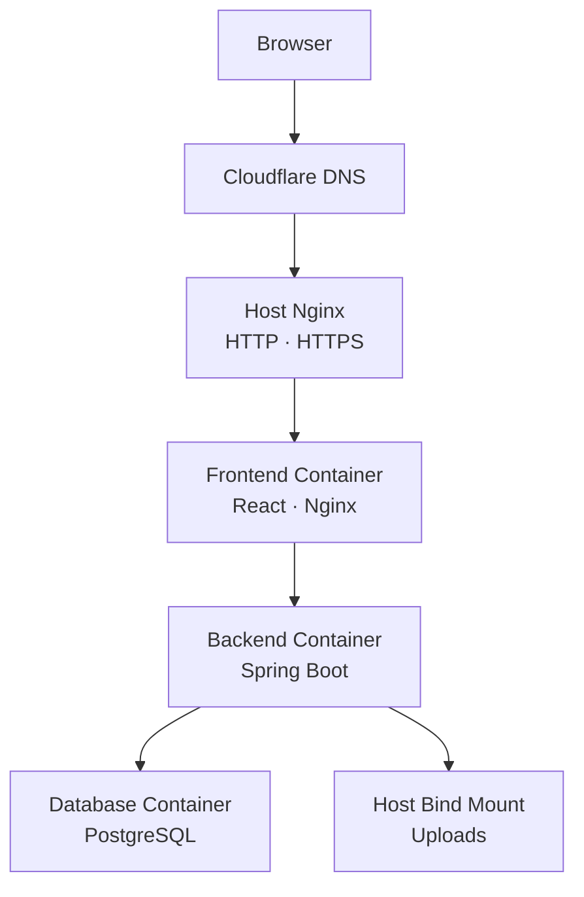
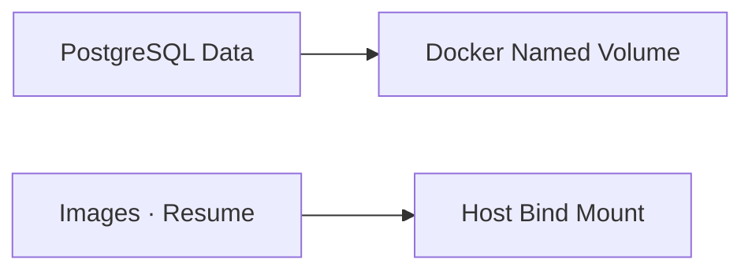

# Song Hye Jin Portfolio

> 기획과 디자인 경험을 바탕으로 사용자 화면, 백엔드 API, 데이터 구조와 운영 환경까지 연결한 콘텐츠형 포트폴리오 사이트

[](https://songhyejin.dev)
[](https://openjdk.org/)
[](https://spring.io/projects/spring-boot)
[](https://react.dev/)
[](https://www.docker.com/)

## 1. 프로젝트 소개

Song Hye Jin Portfolio는 프로젝트 결과물만 나열하는 정적 페이지가 아니라, 관리자가 프로젝트·기술 연구 기록·About·Contact 콘텐츠를 직접 관리할 수 있도록 만든 풀스택 웹 애플리케이션입니다.

마케팅·기획·디자인 업무에서 쌓은 요구사항 분석과 사용자 관점의 경험을 개발 역량으로 확장하고, 다음 과정을 하나의 서비스 안에서 구현했습니다.

- 사용자 관점의 정보 구조와 반응형 UI 설계
- Spring Boot 기반 REST API와 도메인 구조 구현
- PostgreSQL 기반 콘텐츠 데이터 관리
- Session 인증과 CSRF 보호가 적용된 관리자 기능
- 이미지·이력서 파일의 저장 및 생명주기 관리
- Docker Compose, Nginx, HTTPS를 이용한 실제 운영 배포

### 운영 사이트

- 사용자 사이트: [https://songhyejin.dev](https://songhyejin.dev)
- 관리자 페이지는 운영 데이터 보호를 위해 인증된 관리자만 접근할 수 있습니다.

## 2. 주요 기능

### 사용자 페이지

| 페이지 | 주요 내용 |
| --- | --- |
| Home | 개발자 포지셔닝, 핵심 역량, 대표 프로젝트, 개발 과정과 Contact CTA |
| Work | Selected Work, Research, More Project 구성의 프로젝트 목록 |
| Project Detail | 프로젝트 개요, 담당 역할, 기술 스택, 문제 해결 과정, 이미지와 관련 링크 |
| Research | 공개된 기술 연구 기록 목록과 상세 콘텐츠 |
| About | 프로필, 경력 전환 배경, 역량, 경력, 교육, 기술과 수상 이력 |
| Contact | 이메일, GitHub, 이력서 등 연락 및 지원 정보 |

### 관리자 페이지

| 기능 | 주요 내용 |
| --- | --- |
| 관리자 인증 | Session 로그인·로그아웃, 인증 상태 조회, 보호된 관리자 Route |
| CSRF 보호 | CSRF Token 발급 및 변경 요청 검증 |
| Projects | 프로젝트 목록·검색·정렬·등록·조회·수정·삭제·공개 상태 관리 |
| Project Images | 대표·Hero·상세 이미지 업로드 및 파일 참조 관리 |
| Research | 기술 기록 등록·조회·수정·삭제·공개 상태 관리 |
| Rich Text Editor | React·TypeScript 환경에 맞춘 공통 Tiptap 편집기 |
| About | 프로필·역량·경력·교육·기술·수상 정보 관리 |
| Contact | 연락처, 링크와 Resume 정보 관리 |

## 3. 핵심 구현 경험

### 3.1 Session 인증과 CSRF 보호

관리자 API를 공개 CRUD 상태로 두지 않고 Spring Security 기반 Session 인증 구조로 변경했습니다.

- 로그인·로그아웃·현재 인증 상태 API 구현
- 관리자 API와 관리자 화면 Route 보호
- Frontend 요청에 Cookie와 CSRF Token 전달
- 인증되지 않은 요청은 `401 Unauthorized`로 처리
- 상태를 변경하는 요청은 CSRF Token으로 검증
- 초기 관리자 계정은 외부 환경변수로 최초 1회만 생성

### 3.2 이미지 생명주기 관리

파일 업로드와 DB 저장 시점이 분리되면서 발생할 수 있는 미참조 파일 누적 문제를 고려했습니다.

- 업로드 파일을 애플리케이션 외부 디렉터리에 저장
- 확장자와 저장 경로 검증
- UUID와 연월 디렉터리를 이용한 파일명 충돌 방지
- DB에서 참조 중인 이미지와 실제 파일 비교
- 트랜잭션 완료 시점에 맞춘 파일 삭제
- Scheduler를 이용한 고아 이미지 정리
- Docker 컨테이너 재생성 후에도 파일이 유지되는 Bind Mount 구성

### 3.3 관리자 중심 콘텐츠 관리

페이지 전체 HTML을 하나의 문자열로 저장하지 않고, 화면 레이아웃은 Frontend가 담당하고 콘텐츠 데이터는 도메인별로 분리했습니다.

이 구조를 통해 다음 항목을 일관되게 관리합니다.

- 항목별 정렬 순서
- 공개·비공개 상태
- 프로젝트 이미지와 링크
- 기술 카테고리와 담당 역할
- About의 반복 콘텐츠
- 사용자 페이지와 Home에서의 데이터 재사용

### 3.4 실제 운영 배포와 데이터 이전

로컬 개발 환경의 소스 코드뿐 아니라 PostgreSQL 데이터와 업로드 파일까지 운영 서버로 이전했습니다.

- PostgreSQL Custom Format Dump 및 Restore
- 운영 관리자 계정을 유지한 콘텐츠 데이터 마이그레이션
- 프로젝트 이미지·프로필·Skill 로고·Resume 파일 이전
- SHA-256을 이용한 전송 파일 무결성 확인
- DB Sequence 확인 및 신규 프로젝트 등록 검증
- HTTPS 환경에서 사용자 페이지·관리자 기능·파일 응답 확인

## 4. 기술 스택

### Backend

- Java 17
- Spring Boot
- Spring MVC
- Spring Data JPA
- Spring Security
- Bean Validation
- Maven

### Frontend

- React
- TypeScript
- Vite
- React Router
- CSS Modules
- Tiptap

### Database

- PostgreSQL 17

### Infrastructure & Operations

- AWS Lightsail
- Ubuntu 24.04 LTS
- Docker
- Docker Compose
- Nginx
- Cloudflare DNS
- Let's Encrypt
- Certbot

### Development Tools

- Git
- GitHub
- IntelliJ IDEA
- Visual Studio Code
- Git Bash

## 5. 시스템 구조



### 네트워크 구성

| 구성 요소 | 연결 | 공개 범위 |
| --- | --- | --- |
| Host Nginx | `80`, `443` | 외부 공개 |
| Frontend | `127.0.0.1:8080 → 80` | 서버 내부 Loopback |
| Backend | `8081` | Docker Network 내부 |
| PostgreSQL | `5432` | Docker Network 내부 |

호스트 Nginx가 외부 HTTP·HTTPS 요청을 처리하고 Frontend 컨테이너로 전달합니다. Backend와 PostgreSQL은 호스트에 직접 포트를 공개하지 않고, Docker Compose Network에서 서비스 이름으로 통신합니다.

## 6. 데이터 저장 구조



- PostgreSQL 데이터는 Docker Named Volume에 저장합니다.
- 프로젝트 이미지, 프로필 이미지, Skill 로고와 Resume는 Host Bind Mount에 저장합니다.
- 컨테이너가 재생성되어도 DB와 업로드 파일이 유지되도록 실행 환경과 영속 데이터를 분리했습니다.
- `.env`, DB Dump, 업로드 파일과 SSH 개인키는 Git으로 추적하지 않습니다.

## 7. 프로젝트 구조

```text
.
├── backend/
│   ├── src/main/java/
│   ├── src/main/resources/
│   ├── Dockerfile
│   └── pom.xml
├── frontend/
│   ├── src/
│   ├── Dockerfile
│   └── nginx.conf
├── docs/
│   ├── frontend/
│   ├── md/
│   └── operations/
├── .env.example
├── docker-compose.yml
└── README.md
```

## 8. 로컬 실행

### 사전 준비

- Docker
- Docker Compose
- Git

### 저장소 복제

```bash
git clone https://github.com/ssonghe1237/hyejin-portfolio.git
cd hyejin-portfolio
```

### 환경변수 설정

루트의 예제 파일을 기준으로 로컬 `.env`를 작성합니다.

```bash
cp .env.example .env
```

다음 항목을 실제 로컬 값으로 설정합니다.

```text
POSTGRES_DB
POSTGRES_USER
POSTGRES_PASSWORD
ADMIN_BOOTSTRAP_USERNAME
ADMIN_BOOTSTRAP_PASSWORD
UPLOADS_HOST_PATH
FRONTEND_PORT
```

실제 `.env`는 Git에 Commit하지 않습니다.

### Docker Compose 실행

```bash
docker compose config --quiet
docker compose up -d --build
docker compose ps
```

기본 Frontend 포트를 사용하면 다음 주소로 접속합니다.

```text
http://localhost:8080
```

환경에서 `FRONTEND_PORT`를 다르게 설정했다면 해당 포트로 접속합니다.

### 로그 확인

```bash
docker compose logs --tail=150 backend frontend db
```

### 종료

```bash
docker compose down
```

DB 데이터를 유지해야 할 때는 Volume을 삭제하는 `docker compose down -v`를 사용하지 않습니다.

## 9. 보안 및 운영 원칙

- 운영 환경변수는 Git 저장소 외부에서 관리
- SSH는 개인키 인증 사용
- HTTP 요청을 HTTPS로 리다이렉트
- `www.songhyejin.dev` 요청을 대표 도메인 `songhyejin.dev`로 리다이렉트
- Backend와 PostgreSQL 포트 외부 비공개
- 관리자 API Session 인증 적용
- 변경 요청 CSRF 검증
- 관리자 초기 비밀번호는 계정 생성 후 운영 환경변수에서 제거
- Docker 로그 크기 제한
- PostgreSQL과 uploads를 함께 백업
- 운영 데이터 삭제 전 사전 백업 수행

## 10. 배포 구성

본 프로젝트는 AWS Lightsail Ubuntu 인스턴스에서 운영합니다.

- DNS: Cloudflare
- Reverse Proxy: Host Nginx
- TLS Certificate: Let's Encrypt
- Certificate Renewal: Certbot Timer
- Application Runtime: Docker Compose
- Persistent Database: Docker Named Volume
- Persistent Files: Host Bind Mount

### 배포 검증 결과

- PostgreSQL 컨테이너 Health Check 통과
- Backend 정상 실행 및 재시작 횟수 0회
- Frontend 정상 실행
- 홈페이지 및 공개 API `HTTP 200`
- 관리자 로그인·로그아웃 정상
- 관리자 인증 상태 `401 → 200 → 401` 흐름 확인
- 관리자 프로젝트 등록·수정·삭제 확인
- CSRF Token 발급과 변경 요청 검증
- 기존 PostgreSQL 콘텐츠 데이터 이전
- 프로젝트 이미지·프로필·Skill 로고·Resume 파일 이전
- 신규 프로젝트와 파일 업로드 확인
- Nginx 설정 검사 통과
- HTTPS 인증서 발급 및 자동 갱신 Dry Run 통과

운영 서버 경로, 갱신 절차와 장애 확인 방법은 [운영 배포 문서](docs/operations/DEPLOYMENT.md)에서 확인할 수 있습니다.

## 11. 테스트 및 검증

### Backend

```bash
cd backend
./mvnw test
```

검증 결과:

```text
Tests run: 14, Failures: 0, Errors: 0, Skipped: 0
BUILD SUCCESS
```

### Frontend

```bash
cd frontend
npm ci
npm run build
```

Frontend Production Build가 정상적으로 완료되는 것을 확인했습니다.

## 12. 주요 기술적 의사결정

| 주제 | 선택 | 이유 |
| --- | --- | --- |
| 관리자 인증 | Session | 단일 관리자 중심 서비스에서 서버가 인증 상태를 통제하기 용이 |
| 요청 보호 | CSRF Token | Cookie 기반 Session 인증의 변경 요청 보호 |
| 콘텐츠 편집기 | Tiptap | React·TypeScript 호환성과 필요한 기능만 제한하는 구성에 적합 |
| DB 저장 | PostgreSQL Named Volume | 컨테이너 재생성과 데이터 생명주기 분리 |
| 파일 저장 | Host Bind Mount | 이미지·PDF 영속성과 운영 백업 경로 명확화 |
| Frontend 공개 | Loopback Binding | 컨테이너 포트 직접 노출을 막고 Host Nginx를 단일 진입점으로 사용 |
| HTTPS | Nginx + Certbot | 도메인 인증서 발급, HTTP 리다이렉트와 자동 갱신 구성 |
| 운영 설정 | 외부 `.env` | 소스 코드와 Secret 분리 |

## 13. 프로젝트를 통해 배운 점

- 화면 구현뿐 아니라 인증, 데이터, 파일과 배포가 하나의 서비스 흐름으로 연결된다는 점
- DB 데이터와 업로드 파일은 서로 다른 저장소이므로 함께 백업·복원해야 한다는 점
- Docker 컨테이너의 실행 상태와 데이터 영속성은 별도로 설계해야 한다는 점
- Cookie 기반 인증에서는 로그인 구현뿐 아니라 CSRF와 Frontend 요청 설정이 함께 필요하다는 점
- 실제 배포에서는 도메인, DNS, 방화벽, Reverse Proxy와 TLS까지 점검해야 한다는 점
- 오류 메시지만 보는 것이 아니라 DB 상태, 컨테이너 로그, Network 응답을 함께 확인해야 원인을 좁힐 수 있다는 점

## 14. 관련 문서

- [운영 배포 및 관리 절차](docs/operations/DEPLOYMENT.md)
- [`AGENTS.md`](AGENTS.md)

## 15. Author

**Song Hye Jin**

- Portfolio: [https://songhyejin.dev](https://songhyejin.dev)
- GitHub: [https://github.com/ssonghe1237](https://github.com/ssonghe1237)
