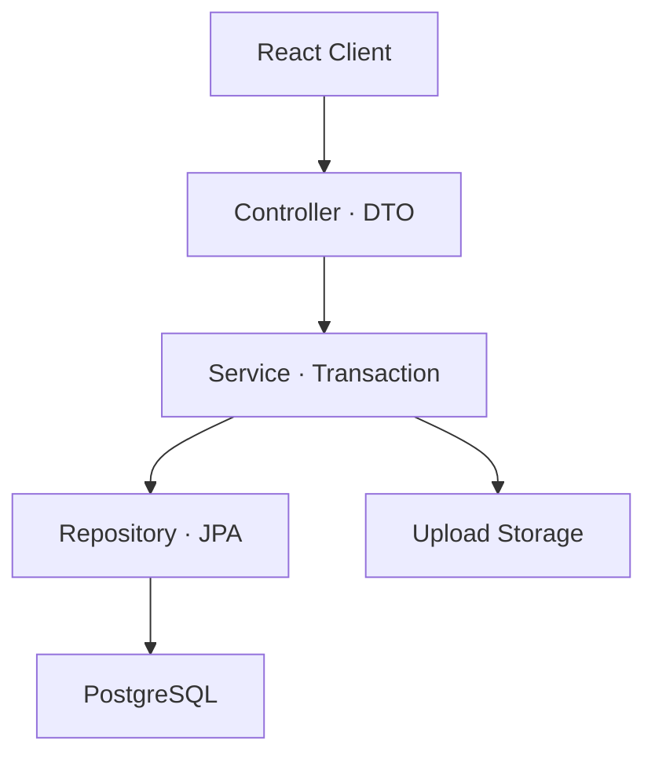

# Backend Domain Structure

> 프로젝트: Hyejin Portfolio
>
> 대상: Spring Boot Backend
>
> 기준 경로: `backend/src/main/java/com/hyejin/portfolio`
>
> 문서 상태: 현재 구현 구조 기준

## 1. 문서 목적

이 문서는 Hyejin Portfolio Backend의 현재 도메인 구성과 계층별 책임, 인증 경계, 파일 저장 구조 및 변경 시 확인사항을 정리합니다.

초기 구현 순서나 앞으로 만들 구조를 제안하는 설계 문서가 아니라, 현재 저장소에 구현된 패키지와 운영 구조를 이해하기 위한 문서입니다.

패키지명, API 계약 및 실제 동작이 이 문서와 다를 경우 다음 항목을 우선적인 Source of Truth로 사용합니다.

1. 현재 Java 소스
2. Controller와 DTO의 API 계약
3. Entity와 실제 PostgreSQL Schema
4. Docker Compose 및 운영 문서

---

## 2. 구조 원칙

Backend는 기능을 먼저 나누고 각 기능 안에서 Controller, Service, Repository, Entity, DTO를 분리하는 **도메인 중심 패키지 구조**를 사용합니다.

```text
domain
├── project
├── about
├── research
├── contact
└── auth
```

프로젝트 전체를 `controller`, `service`, `repository`와 같은 계층으로 먼저 나누는 대신, 하나의 기능에 필요한 코드를 동일한 도메인 아래에 배치합니다.

이 구조의 목적은 다음과 같습니다.

- 기능 변경 시 관련 코드를 한 도메인에서 찾을 수 있음
- 공개 API와 관리자 API가 어떤 데이터를 공유하는지 파악하기 쉬움
- 도메인별 비즈니스 규칙과 트랜잭션 경계를 명확하게 유지
- 기능 증가 시 다른 도메인에 미치는 영향을 줄임
- Entity를 외부 API에 직접 노출하지 않고 DTO 계약을 유지

관리자 기능을 위한 별도의 `domain/admin` 패키지를 만들지 않습니다. 프로젝트·Research·About·Contact의 관리자 Controller와 Service는 각 도메인 안에 위치하며, 로그인과 계정 인증은 `domain/auth`가 담당합니다.

공통 파일 저장 기능도 `domain/file`이라는 별도 업무 도메인으로 구분하지 않습니다. 여러 도메인에서 재사용하는 저장 기능은 `global/upload`에 두고, 프로젝트 이미지·프로필 이미지·Skill 로고·Resume처럼 도메인별 정책이 필요한 기능은 해당 도메인에서 관리합니다.

---

## 3. 전체 패키지 개요

```text
backend/src/main/java/com/hyejin/portfolio
├── BackendApplication.java
├── domain
│   ├── project
│   │   ├── controller
│   │   ├── dto
│   │   ├── entity
│   │   ├── repository
│   │   └── service
│   ├── about
│   │   ├── controller
│   │   ├── dto
│   │   ├── entity
│   │   ├── repository
│   │   └── service
│   ├── research
│   │   ├── controller
│   │   ├── dto
│   │   ├── entity
│   │   ├── repository
│   │   └── service
│   ├── contact
│   │   ├── controller
│   │   ├── dto
│   │   ├── entity
│   │   ├── repository
│   │   └── service
│   └── auth
│       ├── config
│       ├── controller
│       ├── dto
│       ├── entity
│       ├── repository
│       └── service
└── global
    ├── config
    ├── health
    ├── init
    ├── security
    └── upload
```

하위 패키지는 도메인에 필요한 책임에 따라 달라질 수 있습니다. 모든 도메인이 동일한 하위 디렉터리를 반드시 가져야 하는 것은 아닙니다.

---

## 4. 요청 처리 흐름



일반적인 요청은 다음 순서로 처리됩니다.

1. Controller가 HTTP 요청을 받고 Request DTO를 검증합니다.
2. Service가 비즈니스 규칙과 트랜잭션을 처리합니다.
3. Repository가 Entity를 통해 PostgreSQL을 조회하거나 변경합니다.
4. Service가 Entity를 Response DTO로 변환합니다.
5. Controller가 HTTP 상태와 응답을 반환합니다.
6. 파일이 포함된 기능은 Service에서 도메인 규칙에 맞는 저장 서비스를 호출합니다.

Controller에서 Repository를 직접 호출하거나 Entity를 그대로 응답하지 않습니다.

---

## 5. 계층별 책임

| 계층 | 주요 책임 | 포함하지 않는 책임 |
| --- | --- | --- |
| Controller | URL Mapping, 요청 DTO 검증, Service 호출, HTTP 응답 | 영속성 처리, 복잡한 비즈니스 로직 |
| DTO | API 요청·응답 계약, Validation | DB 관계와 영속성 상태 |
| Service | 비즈니스 규칙, 트랜잭션, Entity·DTO 변환, 파일 처리 조정 | HTTP 화면 구성 |
| Repository | JPA 기반 저장·조회, 조건 조회 | API 응답 구성, 파일 저장 |
| Entity | 테이블 Mapping, 관계, 도메인 상태 | Controller 응답 모델 |
| Global | 여러 도메인에서 재사용하는 설정·보안·업로드 기능 | 특정 도메인의 업무 규칙 |

### 5.1 Controller

Controller는 공개 사용자 API와 관리자 API의 HTTP 경계를 담당합니다.

- `@PathVariable`, `@RequestParam`, `@RequestBody` 처리
- 요청 DTO Validation
- 인증된 요청의 Service 전달
- 적절한 HTTP 상태와 Response DTO 반환

관리자 Controller가 각 도메인 안에 있더라도 접근 제어는 공통 Spring Security 정책을 따라야 합니다.

### 5.2 Service

Service는 도메인의 핵심 동작과 트랜잭션 경계를 담당합니다.

- 공개 상태와 정렬 정책 적용
- 등록·수정·삭제
- Slug와 고정 키 등 도메인 식별자 검증
- 자식 Entity 관계 갱신
- Entity와 DTO 변환
- 업로드 파일 저장 및 기존 파일 정리 흐름 조정

조회 작업에는 필요한 경우 읽기 전용 트랜잭션을 사용하고, 변경 작업은 하나의 명확한 트랜잭션 경계에서 처리합니다.

### 5.3 Repository

Repository는 JPA를 통한 영속성 접근만 담당합니다.

- ID 또는 업무 식별자 조회
- 공개 상태를 포함한 조건 조회
- 정렬과 중복 확인
- Entity 저장과 삭제

파생 Query Method 이름은 DB 컬럼명이 아니라 Java Entity 필드명을 기준으로 작성합니다.

### 5.4 Entity

Entity는 PostgreSQL 테이블과 매핑되는 영속 객체입니다.

- 컬럼과 제약조건 Mapping
- 연관관계와 소유관계
- 생성·수정 시각
- 도메인 상태

모든 필드에 공개 Setter를 제공하지 않고, 필요한 경우 의미가 명확한 생성자 또는 상태 변경 메서드를 사용합니다.

### 5.5 DTO

DTO는 Frontend와 Backend 사이의 API 계약입니다.

- Request DTO: 입력값과 Validation
- Response DTO: 화면과 기능에 필요한 응답 구조
- Entity 내부 구조의 직접 노출 방지

DTO 또는 API 필드를 변경하면 해당 API를 사용하는 Frontend Type과 호출 코드를 함께 확인합니다.

---

## 6. 도메인별 책임

### 6.1 Project

`domain/project`는 포트폴리오의 프로젝트 콘텐츠를 관리합니다.

주요 기능:

- 공개 프로젝트 목록과 Slug 기반 상세 조회
- 관리자 프로젝트 목록·상세·등록·수정·삭제
- 공개·비공개 상태 및 정렬 관리
- 기술스택, 링크, 섹션 및 이미지 관리
- 프로젝트 이미지 업로드와 고아 파일 정리

관련 테이블:

| 테이블 | 역할 |
| --- | --- |
| `projects` | 프로젝트 기본 정보와 공개·정렬 상태 |
| `project_techs` | 프로젝트 기술스택 |
| `project_links` | GitHub, 배포 주소 등 외부 링크 |
| `project_sections` | 상세 페이지의 순서형 콘텐츠 |
| `project_images` | 썸네일·Hero·섹션 이미지 |

`project_images`는 프로젝트에 필수로 연결되고 필요에 따라 특정 프로젝트 섹션에도 연결됩니다. DB는 이미지의 `project_id`와 섹션이 속한 프로젝트가 같은지까지 자동으로 보장하지 않으므로 Service에서 관계 정합성을 유지해야 합니다.

### 6.2 About

`domain/about`는 소개 페이지의 프로필과 세부 콘텐츠를 관리합니다.

주요 기능:

- 공개 About 조회와 관리자 콘텐츠 갱신
- 프로필 기본 정보와 공개 상태 관리
- 섹션·역량·교육·수상·경력 관리
- 기술 카테고리와 Skill 관리
- 프로필 이미지 및 Skill 로고 저장

관련 테이블:

| 테이블 | 역할 |
| --- | --- |
| `about_profiles` | About 기본 정보와 고정 키 |
| `about_sections` | Rich Text 소개 섹션 |
| `about_competencies` | 핵심 역량 |
| `about_educations` | 교육·학력 |
| `about_awards` | 수상 이력 |
| `about_work_experiences` | 근무 이력 |
| `about_skill_categories` | 기술 분류 |
| `about_skills` | 기술과 로고 URL |

`singleton_key`의 UNIQUE 제약조건은 같은 키의 중복만 방지합니다. 테이블 전체의 행 수를 정확히 하나로 제한하지는 않으므로, 고정 키를 사용하는 조회·저장 정책은 Service에서 유지합니다.

### 6.3 Research

`domain/research`는 기술 학습 및 문제 해결 기록을 관리합니다.

- 공개된 Research 목록·상세 조회
- 관리자 Research 등록·수정·삭제
- 공개 상태와 정렬 정책 적용
- Rich Text 콘텐츠 관리

관련 테이블은 `research_posts`입니다. 사용자 화면에는 공개된 콘텐츠만 노출하고, 관리자 기능은 인증된 요청에서 전체 상태를 관리합니다.

### 6.4 Contact

`domain/contact`는 연락처와 Resume 콘텐츠를 관리합니다.

- 공개 Contact 정보 조회
- 관리자 Contact 정보 갱신
- Resume PDF 업로드와 교체
- 파일 URL과 공개 상태 관리

관련 테이블은 `contact_profiles`입니다. DB에는 파일 자체가 아니라 Resume URL이 저장되며, 실제 PDF는 Host uploads 디렉터리에 있으므로 DB와 파일을 함께 백업해야 합니다.

### 6.5 Auth

`domain/auth`는 관리자 계정과 Session 인증을 관리합니다.

- CSRF Token 발급
- 관리자 로그인과 로그아웃
- 현재 인증 사용자 조회
- 최초 관리자 계정 Bootstrap
- 관리자 UserDetails 조회

주요 인증 Endpoint:

| Method | Endpoint | 역할 |
| --- | --- | --- |
| `GET` | `/api/auth/csrf` | CSRF Token과 Session 초기화 |
| `POST` | `/api/auth/login` | 관리자 로그인 |
| `GET` | `/api/auth/me` | 현재 인증된 관리자 확인 |
| `POST` | `/api/auth/logout` | Session 로그아웃 |

관련 테이블은 `admin_users`입니다.

현재 인증 방식은 JWT가 아니라 **서버 Session과 CSRF 보호**를 사용합니다. 관리자 비밀번호는 평문으로 저장하지 않고 PasswordEncoder를 통해 Hash로 저장합니다.

Bootstrap 환경변수는 최초 관리자 생성에만 사용합니다. 동일한 사용자명이 이미 있으면 기존 비밀번호를 임의로 변경하지 않으며, 최초 계정 생성이 완료된 운영 환경에서는 Bootstrap 인증정보를 제거합니다.

---

## 7. Global 패키지

| 패키지 | 책임 |
| --- | --- |
| `global/config` | 애플리케이션 공통 설정 |
| `global/health` | 상태 확인 API |
| `global/init` | 필요한 초기 데이터 처리 |
| `global/security` | Spring Security, Session, CSRF 및 관리자 접근 정책 |
| `global/upload` | 여러 도메인에서 재사용하는 이미지 저장 기능 |

Global 패키지에는 여러 도메인이 공유하는 기능만 배치합니다. 특정 도메인에서만 사용하는 업무 규칙을 편의를 이유로 Global로 이동하지 않습니다.

---

## 8. 공개 API와 관리자 API

공개 API와 관리자 API는 동일한 도메인 데이터를 사용하지만 책임과 접근 범위가 다릅니다.

| 구분 | 공개 API | 관리자 API |
| --- | --- | --- |
| 대상 | 일반 방문자 | 인증된 관리자 |
| 조회 범위 | 공개된 콘텐츠 | 공개·비공개 전체 |
| 변경 기능 | 없음 | 등록·수정·삭제 |
| 인증 | 공개 허용 | Session 인증과 CSRF 검증 |
| 주요 Prefix | `/api/...` | `/api/admin/...` |

공개 조회에서는 공개 상태와 정렬 규칙을 Service 또는 Repository에서 일관되게 적용합니다. 관리자 변경 요청은 인증뿐 아니라 CSRF 검증도 통과해야 합니다.

---

## 9. 파일 저장 구조

이미지와 PDF는 PostgreSQL에 Binary로 저장하지 않습니다.

```text
PostgreSQL
└── 파일 URL과 콘텐츠 관계

Host uploads
├── projects/
├── profile/
├── skills/
└── resumes/
```

환경에 따라 uploads의 실제 Host 경로가 달라질 수 있으며, 운영에서는 Docker Bind Mount를 통해 Backend 컨테이너의 업로드 경로와 연결합니다.

파일 처리 시 다음 사항을 함께 고려합니다.

- 허용 확장자와 파일명 검증
- UUID 기반 저장 파일명
- 연·월 단위 디렉터리
- DB URL과 실제 파일의 관계
- 등록 취소 또는 변경 실패 시 임시 파일
- DB Commit 이후 기존 파일 삭제
- DB와 uploads의 동시 백업
- 고아 파일 정리 정책

DB 트랜잭션과 Host 파일 시스템 작업은 하나의 원자적 트랜잭션이 아닙니다. 따라서 파일을 먼저 삭제한 뒤 DB 변경이 실패하는 순서를 피하고, 실패·Rollback·Commit 시점의 파일 처리 흐름을 함께 검토해야 합니다.

---

## 10. JPA와 물리 Schema

JPA Entity 관계와 PostgreSQL의 실제 FK 정책을 같은 것으로 해석하지 않습니다.

- JPA의 `CascadeType.ALL`과 `orphanRemoval=true`는 JPA를 통한 Entity 처리 규칙입니다.
- 현재 PostgreSQL FK는 별도의 `ON DELETE CASCADE` 없이 `NO ACTION` 정책을 사용합니다.
- 부모 행을 직접 SQL로 삭제하는 동작은 JPA Service를 통한 삭제와 결과가 다를 수 있습니다.
- PK와 UNIQUE가 생성하는 Index 외의 추가 Index는 실제 Query와 실행 계획을 확인한 뒤 결정합니다.
- Entity 또는 Schema를 변경하면 ERD와 Schema 문서도 함께 갱신합니다.

운영 Compose는 현재 Spring Profile `prod`와 Hibernate `ddl-auto=update`를 사용합니다. 광범위한 Schema 변경을 자동 반영에 의존하지 말고, 변경 전 DB 백업과 영향 분석을 수행합니다.

---

## 11. 변경 시 확인사항

### 11.1 API 변경

- Controller Mapping
- Request·Response DTO와 Validation
- Frontend API 함수와 Type
- 공개 API와 관리자 API 영향
- Session 인증과 CSRF 정책

### 11.2 Entity 또는 DB 변경

- Entity 필드와 DB 컬럼명
- Nullable, Length, Enum
- PK, FK, UNIQUE, CHECK
- JPA Cascade와 DB 삭제 정책
- 기존 운영 데이터 영향
- ERD와 Schema SQL 갱신
- 배포 전 DB 백업

### 11.3 파일 업로드 변경

- 허용 확장자와 최대 크기
- 파일 URL Prefix와 Docker Bind Mount
- 기존 파일 교체 시점
- Rollback 시 고아 파일 가능성
- 스케줄러와 정리 서비스 영향
- DB와 uploads 백업

### 11.4 인증 변경

- Session 생성·종료
- CSRF Token 발급·전달
- 보호 URL Pattern과 미인증 상태 코드
- 관리자 계정 `enabled` 상태
- 비밀번호 Encoding
- Frontend의 `credentials` 및 CSRF Header

---

## 12. 검증

Backend 변경 후 Backend 디렉터리에서 다음 명령을 실행합니다.

```bash
cd backend
./mvnw test
```

구조·설정 또는 배포 관련 변경은 필요한 경우 다음 명령으로 전체 검증합니다.

```bash
cd backend
./mvnw clean verify
```

함께 확인할 항목:

- 테스트 실패·오류·Skip
- 애플리케이션 시작과 PostgreSQL 연결
- 공개 API 응답
- 관리자 로그인·로그아웃과 CRUD
- 이미지 및 PDF 업로드
- 로그아웃 후 보호 API 차단

문서만 변경했다면 Backend Test를 생략할 수 있으며, 생략 이유를 작업 보고에 명시합니다.

---

## 13. 관련 문서

- [데이터베이스 ERD](../db/ERD.md)
- [Backend 의존성과 빌드](../development/backend-dependencies.md)
- [운영 배포 가이드](../operations/DEPLOYMENT.md)
- [프로젝트 README](../../README.md)

이 문서는 Backend 패키지나 주요 도메인 책임이 변경될 때 함께 갱신합니다.
