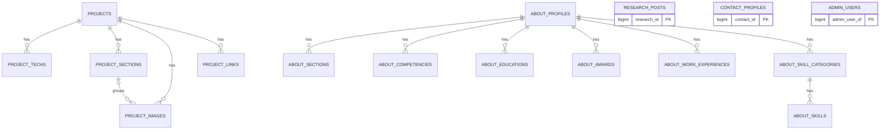
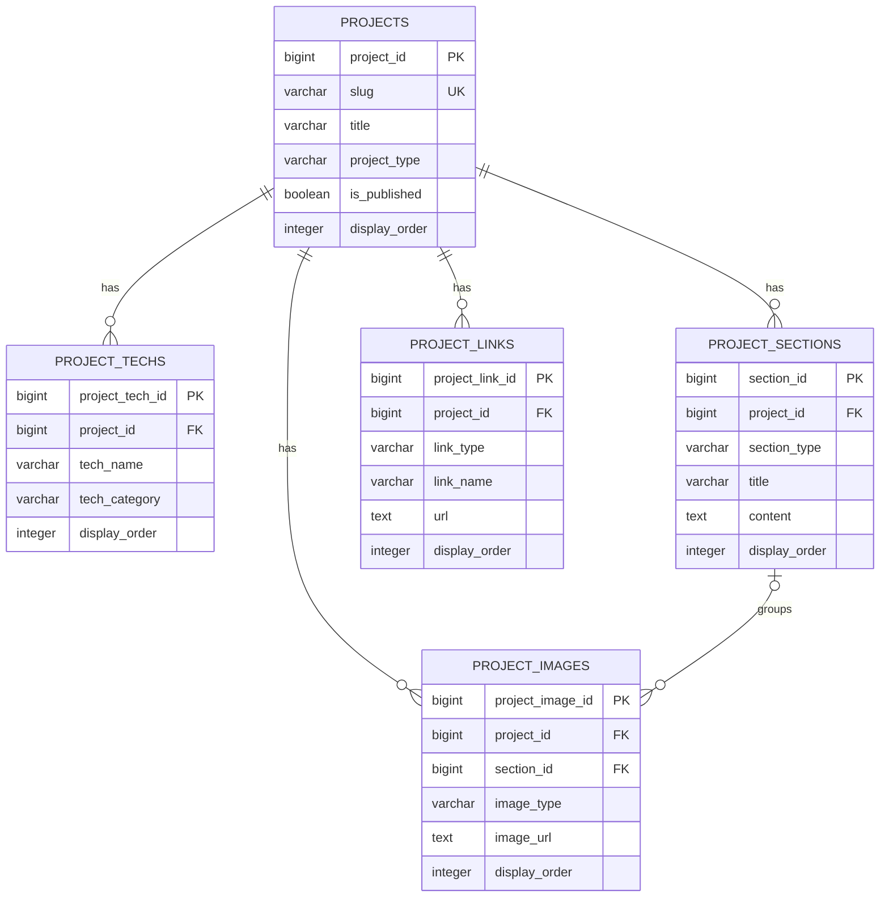
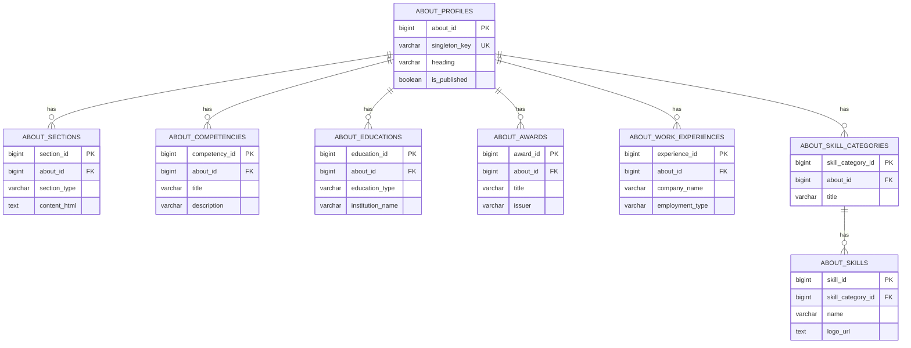
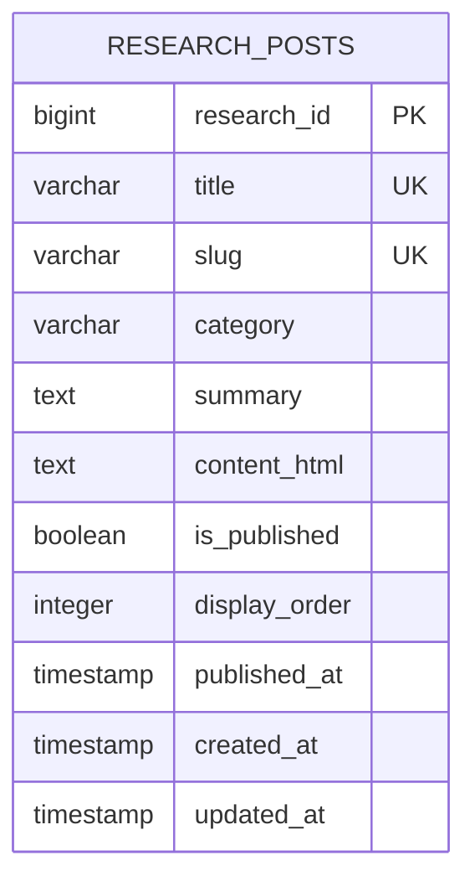
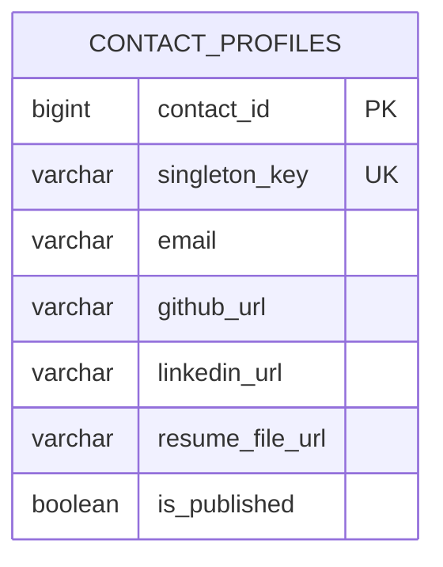
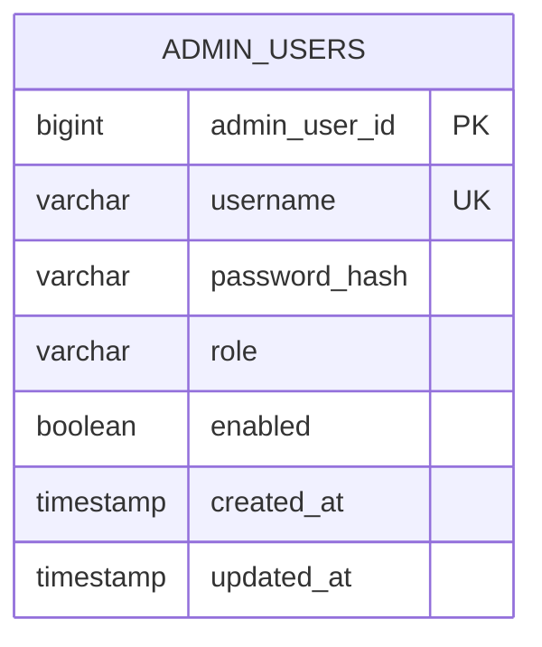

# Portfolio Database ERD

## 1. 문서 목적

이 문서는 Song Hye Jin Portfolio의 현재 PostgreSQL 데이터 구조와 도메인 관계를 설명합니다.

초기 설계 문서가 아니라 실제 로컬 PostgreSQL에서 추출한 `schema-only` Dump를 기준으로 작성했습니다. JPA 연관관계와 물리 Database 제약조건이 다른 경우에는 PostgreSQL Schema를 물리 구조의 기준으로 사용합니다.

## 2. 기준 정보

| 항목 | 내용 |
| --- | --- |
| Database | PostgreSQL 17.11 |
| Schema | `public` |
| 기준 자료 | `pg_dump --schema-only --no-owner --no-privileges` |
| 작성 기준일 | 2026-09-08 |
| 테이블 | 16개 |
| PK | 16개 |
| Identity Sequence | 16개 |
| FK | 12개 |
| UNIQUE | 6개 |
| CHECK | 8개 |
| 별도 `CREATE INDEX` | 없음 |

Schema Dump에는 실제 데이터, 관리자 비밀번호, 운영 환경변수와 개인정보가 포함되지 않습니다.

## 3. 도메인 구성

| 도메인 | 테이블 | 역할 |
| --- | ---: | --- |
| Project | 5 | 프로젝트 기본 정보, 기술, 섹션, 이미지, 링크 |
| About | 8 | 프로필, 소개 섹션, 역량, 경력, 교육, 수상, 기술 분류와 기술 |
| Research | 1 | 기술 연구 기록 |
| Contact | 1 | 공개 연락처와 Resume 정보 |
| Admin Authentication | 1 | 관리자 인증 계정 |

## 4. 전체 관계 ERD



`RESEARCH_POSTS`, `CONTACT_PROFILES`, `ADMIN_USERS`는 현재 다른 도메인 테이블과 물리 FK 관계가 없는 독립 테이블입니다.

## 5. Project 도메인

### 관계



### `projects`

프로젝트의 기본 정보, 공개 상태와 사용자 화면 노출 순서를 관리하는 Aggregate Root입니다.

| 컬럼 | 타입 | 제약 | 설명 |
| --- | --- | --- | --- |
| `project_id` | `bigint` | PK, Identity | 프로젝트 식별자 |
| `created_at` | `timestamp(6)` | NOT NULL | 생성일시 |
| `description` | `text` | NULL 허용 | 프로젝트 상세 설명 |
| `display_order` | `integer` | NOT NULL | 노출 정렬 순서 |
| `end_date` | `date` | NULL 허용 | 종료일 |
| `project_type` | `varchar(200)` | NOT NULL, CHECK | `TEAM`, `PERSONAL` |
| `is_published` | `boolean` | NOT NULL | 공개 여부 |
| `role` | `text` | NULL 허용 | 담당 역할 |
| `slug` | `varchar(200)` | NOT NULL, UNIQUE | 상세 URL 식별자 |
| `start_date` | `date` | NULL 허용 | 시작일 |
| `summary` | `text` | NOT NULL | 프로젝트 요약 |
| `team_name` | `varchar(200)` | NULL 허용 | 팀명 |
| `title` | `varchar(200)` | NOT NULL | 프로젝트명 |
| `updated_at` | `timestamp(6)` | NOT NULL | 수정일시 |

### `project_techs`

프로젝트에서 사용한 기술과 기술 분류를 저장합니다.

| 컬럼 | 타입 | 제약 | 설명 |
| --- | --- | --- | --- |
| `project_tech_id` | `bigint` | PK, Identity | 프로젝트 기술 식별자 |
| `display_order` | `integer` | NOT NULL | 표시 순서 |
| `tech_category` | `varchar(100)` | NULL 허용 | Frontend, Backend 등 분류 |
| `tech_name` | `varchar(100)` | NOT NULL | 기술명 |
| `project_id` | `bigint` | NOT NULL, FK | `projects.project_id` 참조 |

### `project_sections`

프로젝트 상세 페이지의 반복 콘텐츠 섹션을 저장합니다.

| 컬럼 | 타입 | 제약 | 설명 |
| --- | --- | --- | --- |
| `section_id` | `bigint` | PK, Identity | 섹션 식별자 |
| `content` | `text` | NULL 허용 | 섹션 본문 |
| `display_order` | `integer` | NOT NULL | 표시 순서 |
| `section_type` | `varchar(100)` | NOT NULL, CHECK | 섹션 유형 |
| `title` | `varchar(200)` | NULL 허용 | 섹션 제목 |
| `project_id` | `bigint` | NOT NULL, FK | `projects.project_id` 참조 |

허용되는 `section_type`:

```text
CONTENTS
OVERVIEW
MY_ROLE
TECH_STACK
KEY_FEATURES
ARCHITECTURE
DATABASE_ERD
WORKFLOW
TROUBLESHOOTING
RESULT
LINKS
```

### `project_images`

프로젝트 대표 이미지와 상세 섹션 이미지를 함께 관리합니다.

| 컬럼 | 타입 | 제약 | 설명 |
| --- | --- | --- | --- |
| `project_image_id` | `bigint` | PK, Identity | 이미지 식별자 |
| `caption` | `varchar(300)` | NULL 허용 | 이미지 설명 |
| `display_order` | `integer` | NOT NULL | 표시 순서 |
| `image_type` | `varchar(50)` | NOT NULL, CHECK | 이미지 용도 |
| `image_url` | `text` | NOT NULL | 실제 파일 접근 URL |
| `project_id` | `bigint` | NOT NULL, FK | `projects.project_id` 참조 |
| `section_id` | `bigint` | NULL 허용, FK | `project_sections.section_id` 선택 참조 |

허용되는 `image_type`:

```text
THUMBNAIL
MAIN
DETAIL
ERD
ARCHITECTURE
SCREENSHOT
```

`section_id`가 `NULL`이면 프로젝트 전체 이미지이고, 값이 있으면 특정 상세 섹션에 연결된 이미지입니다.

### `project_links`

GitHub, 배포 사이트, PDF와 외부 문서 링크를 관리합니다.

| 컬럼 | 타입 | 제약 | 설명 |
| --- | --- | --- | --- |
| `project_link_id` | `bigint` | PK, Identity | 링크 식별자 |
| `display_order` | `integer` | NOT NULL | 표시 순서 |
| `link_name` | `varchar(100)` | NOT NULL | 화면 표시명 |
| `link_type` | `varchar(50)` | NOT NULL, CHECK | 링크 유형 |
| `url` | `text` | NOT NULL | 링크 URL |
| `project_id` | `bigint` | NOT NULL, FK | `projects.project_id` 참조 |

허용되는 `link_type`:

```text
GITHUB
DEPLOY
PDF
NOTION
RESUME
SARAMIN
ETC
```

## 6. About 도메인

### 관계



### `about_profiles`

About 페이지의 공개 상태와 기본 프로필을 관리합니다. 애플리케이션에서 고정된 `singleton_key`를 사용해 단일 프로필처럼 운용합니다.

| 컬럼 | 타입 | 제약 | 설명 |
| --- | --- | --- | --- |
| `about_id` | `bigint` | PK, Identity | About 식별자 |
| `created_at` | `timestamp(6)` | NOT NULL | 생성일시 |
| `cta_label` | `varchar(100)` | NOT NULL | CTA 문구 |
| `cta_url` | `varchar(500)` | NOT NULL | CTA URL |
| `heading` | `varchar(200)` | NOT NULL | 대표 제목 |
| `is_published` | `boolean` | NOT NULL | 공개 여부 |
| `summary` | `varchar(1000)` | NOT NULL | 프로필 요약 |
| `updated_at` | `timestamp(6)` | NOT NULL | 수정일시 |
| `singleton_key` | `varchar(30)` | NOT NULL, UNIQUE | 단일 프로필 조회 키 |
| `background` | `varchar(200)` | NULL 허용 | 경력 배경 요약 |
| `birth_date` | `date` | NULL 허용 | 생년월일 |
| `current_focus` | `varchar(200)` | NULL 허용 | 현재 집중 분야 |
| `interests` | `varchar(500)` | NULL 허용 | 관심사 |
| `location` | `varchar(200)` | NULL 허용 | 거주 지역 |
| `name_en` | `varchar(100)` | NULL 허용 | 영문 이름 |
| `name_ko` | `varchar(100)` | NULL 허용 | 한글 이름 |
| `position` | `varchar(150)` | NULL 허용 | 포지션 |
| `profile_image_url` | `text` | NULL 허용 | 프로필 이미지 URL |

### `about_sections`

About 페이지의 기술·문제 해결·스토리형 Rich Text 섹션입니다.

| 컬럼 | 타입 | 제약 | 설명 |
| --- | --- | --- | --- |
| `section_id` | `bigint` | PK, Identity | 섹션 식별자 |
| `content_html` | `text` | NOT NULL | HTML 본문 |
| `display_order` | `integer` | NOT NULL | 표시 순서 |
| `title` | `varchar(150)` | NOT NULL | 섹션 제목 |
| `about_id` | `bigint` | NOT NULL, FK | `about_profiles.about_id` 참조 |
| `section_type` | `varchar(30)` | NULL 허용, CHECK | 섹션 유형 |

허용되는 `section_type`:

```text
TECHNICAL_STACK
TROUBLESHOOTING
STORY
```

### `about_competencies`

About 화면의 핵심 역량을 관리합니다.

| 컬럼 | 타입 | 제약 | 설명 |
| --- | --- | --- | --- |
| `competency_id` | `bigint` | PK, Identity | 역량 식별자 |
| `description` | `varchar(1000)` | NOT NULL | 역량 설명 |
| `display_order` | `integer` | NOT NULL | 표시 순서 |
| `title` | `varchar(150)` | NOT NULL | 역량명 |
| `about_id` | `bigint` | NOT NULL, FK | `about_profiles.about_id` 참조 |

### `about_educations`

학교와 개발 교육 과정 정보를 관리합니다.

| 컬럼 | 타입 | 제약 | 설명 |
| --- | --- | --- | --- |
| `education_id` | `bigint` | PK, Identity | 교육 식별자 |
| `course_name` | `varchar(300)` | NOT NULL | 과정명 |
| `description` | `text` | NULL 허용 | 과정 설명 |
| `display_order` | `integer` | NOT NULL | 표시 순서 |
| `education_type` | `varchar(30)` | NOT NULL, CHECK | `SCHOOL`, `TRAINING` |
| `end_date` | `date` | NULL 허용 | 종료일 |
| `institution_name` | `varchar(200)` | NOT NULL | 기관명 |
| `start_date` | `date` | NOT NULL | 시작일 |
| `status` | `varchar(100)` | NULL 허용 | 졸업·수료 상태 |
| `about_id` | `bigint` | NOT NULL, FK | `about_profiles.about_id` 참조 |

### `about_awards`

수상 및 자격 관련 이력을 관리합니다.

| 컬럼 | 타입 | 제약 | 설명 |
| --- | --- | --- | --- |
| `award_id` | `bigint` | PK, Identity | 수상 식별자 |
| `awarded_date` | `date` | NOT NULL | 취득·수상일 |
| `description` | `text` | NULL 허용 | 상세 설명 |
| `display_order` | `integer` | NOT NULL | 표시 순서 |
| `issuer` | `varchar(200)` | NOT NULL | 발급·수여 기관 |
| `title` | `varchar(200)` | NOT NULL | 수상·자격명 |
| `about_id` | `bigint` | NOT NULL, FK | `about_profiles.about_id` 참조 |

### `about_work_experiences`

근무 경험과 담당 업무를 Rich Text로 관리합니다.

| 컬럼 | 타입 | 제약 | 설명 |
| --- | --- | --- | --- |
| `experience_id` | `bigint` | PK, Identity | 경력 식별자 |
| `company_name` | `varchar(200)` | NOT NULL | 회사명 |
| `description_html` | `text` | NOT NULL | 담당 업무와 경험 HTML |
| `display_order` | `integer` | NOT NULL | 표시 순서 |
| `employment_type` | `varchar(30)` | NOT NULL, CHECK | 근무 형태 |
| `end_date` | `date` | NULL 허용 | 종료일 |
| `position_title` | `varchar(200)` | NOT NULL | 직책·포지션 |
| `start_date` | `date` | NOT NULL | 시작일 |
| `about_id` | `bigint` | NOT NULL, FK | `about_profiles.about_id` 참조 |

허용되는 `employment_type`:

```text
FULL_TIME
FREELANCE
INTERN
CONTRACT
```

### `about_skill_categories`

Frontend, Backend 등 기술 그룹을 관리합니다.

| 컬럼 | 타입 | 제약 | 설명 |
| --- | --- | --- | --- |
| `skill_category_id` | `bigint` | PK, Identity | 기술 분류 식별자 |
| `description` | `varchar(500)` | NULL 허용 | 분류 설명 |
| `display_order` | `integer` | NOT NULL | 표시 순서 |
| `title` | `varchar(150)` | NOT NULL | 분류명 |
| `about_id` | `bigint` | NOT NULL, FK | `about_profiles.about_id` 참조 |

### `about_skills`

기술 분류에 포함되는 개별 기술과 로고를 관리합니다.

| 컬럼 | 타입 | 제약 | 설명 |
| --- | --- | --- | --- |
| `skill_id` | `bigint` | PK, Identity | 기술 식별자 |
| `description` | `varchar(300)` | NULL 허용 | 기술 설명 |
| `display_order` | `integer` | NOT NULL | 표시 순서 |
| `logo_url` | `text` | NULL 허용 | 기술 로고 URL |
| `name` | `varchar(100)` | NOT NULL | 기술명 |
| `skill_category_id` | `bigint` | NOT NULL, FK | `about_skill_categories.skill_category_id` 참조 |

## 7. Research 도메인



### `research_posts`

기술 연구와 문제 해결 기록을 저장하는 독립 콘텐츠 테이블입니다.

| 컬럼 | 타입 | 제약 | 설명 |
| --- | --- | --- | --- |
| `research_id` | `bigint` | PK, Identity | Research 식별자 |
| `category` | `varchar(100)` | NOT NULL | 카테고리 문자열 |
| `content_html` | `text` | NOT NULL | Tiptap 기반 HTML 본문 |
| `created_at` | `timestamp(6)` | NOT NULL | 생성일시 |
| `display_order` | `integer` | NOT NULL | 표시 순서 |
| `is_published` | `boolean` | NOT NULL | 공개 여부 |
| `published_at` | `timestamp(6)` | NULL 허용 | 공개일시 |
| `slug` | `varchar(200)` | NOT NULL, UNIQUE | 상세 URL 식별자 |
| `summary` | `text` | NOT NULL | 요약 |
| `title` | `varchar(200)` | NOT NULL, UNIQUE | 제목 |
| `updated_at` | `timestamp(6)` | NOT NULL | 수정일시 |

`category`는 현재 DB CHECK 또는 별도 Category 테이블이 없는 자유 문자열입니다.

## 8. Contact 도메인



### `contact_profiles`

사용자 Contact 페이지에 노출되는 연락처와 Resume 정보를 관리합니다.

| 컬럼 | 타입 | 제약 | 설명 |
| --- | --- | --- | --- |
| `contact_id` | `bigint` | PK, Identity | Contact 식별자 |
| `created_at` | `timestamp(6)` | NOT NULL | 생성일시 |
| `description` | `varchar(1000)` | NOT NULL | 연락 안내 설명 |
| `email` | `varchar(255)` | NOT NULL | 공개 이메일 |
| `github_url` | `varchar(500)` | NOT NULL | GitHub URL |
| `heading` | `varchar(200)` | NOT NULL | 대표 제목 |
| `linkedin_url` | `varchar(500)` | NULL 허용 | LinkedIn URL |
| `is_published` | `boolean` | NOT NULL | 공개 여부 |
| `resume_file_url` | `varchar(1000)` | NULL 허용 | Resume 파일 URL |
| `resume_label` | `varchar(100)` | NOT NULL | Resume 링크 문구 |
| `resume_original_file_name` | `varchar(500)` | NULL 허용 | 업로드 원본 파일명 |
| `singleton_key` | `varchar(30)` | NOT NULL, UNIQUE | 단일 Contact 조회 키 |
| `updated_at` | `timestamp(6)` | NOT NULL | 수정일시 |

## 9. Admin Authentication 도메인



### `admin_users`

관리자 Session 인증에 사용하는 계정을 관리합니다.

| 컬럼 | 타입 | 제약 | 설명 |
| --- | --- | --- | --- |
| `admin_user_id` | `bigint` | PK, Identity | 관리자 식별자 |
| `created_at` | `timestamp(6)` | NOT NULL | 생성일시 |
| `enabled` | `boolean` | NOT NULL | 로그인 가능 상태 |
| `password_hash` | `varchar(100)` | NOT NULL | 암호화된 비밀번호 Hash |
| `role` | `varchar(30)` | NOT NULL, CHECK | DB 저장값 `ADMIN` |
| `updated_at` | `timestamp(6)` | NOT NULL | 수정일시 |
| `username` | `varchar(100)` | NOT NULL, UNIQUE | 관리자 로그인 ID |

DB의 권한 저장값은 `ADMIN`이고 Spring Security에서는 `ROLE_ADMIN`으로 변환해 사용합니다. 평문 비밀번호는 DB에 저장하지 않습니다.

## 10. 물리 제약조건

### UNIQUE

| 테이블 | 컬럼 | 목적 |
| --- | --- | --- |
| `projects` | `slug` | 프로젝트 상세 URL 중복 방지 |
| `research_posts` | `title` | Research 제목 중복 방지 |
| `research_posts` | `slug` | Research 상세 URL 중복 방지 |
| `about_profiles` | `singleton_key` | 고정 About 조회 키 중복 방지 |
| `contact_profiles` | `singleton_key` | 고정 Contact 조회 키 중복 방지 |
| `admin_users` | `username` | 관리자 ID 중복 방지 |

PostgreSQL Schema에는 6개의 UNIQUE Constraint가 있으며, `research_posts`는 `title`과 `slug`에 각각 별도 제약을 가집니다.

### CHECK

| 테이블 | 컬럼 | 허용 값 |
| --- | --- | --- |
| `projects` | `project_type` | `TEAM`, `PERSONAL` |
| `project_images` | `image_type` | `THUMBNAIL`, `MAIN`, `DETAIL`, `ERD`, `ARCHITECTURE`, `SCREENSHOT` |
| `project_links` | `link_type` | `GITHUB`, `DEPLOY`, `PDF`, `NOTION`, `RESUME`, `SARAMIN`, `ETC` |
| `project_sections` | `section_type` | `CONTENTS`, `OVERVIEW`, `MY_ROLE`, `TECH_STACK`, `KEY_FEATURES`, `ARCHITECTURE`, `DATABASE_ERD`, `WORKFLOW`, `TROUBLESHOOTING`, `RESULT`, `LINKS` |
| `about_educations` | `education_type` | `SCHOOL`, `TRAINING` |
| `about_sections` | `section_type` | `TECHNICAL_STACK`, `TROUBLESHOOTING`, `STORY` |
| `about_work_experiences` | `employment_type` | `FULL_TIME`, `FREELANCE`, `INTERN`, `CONTRACT` |
| `admin_users` | `role` | `ADMIN` |

Schema에는 총 8개의 CHECK Constraint가 있습니다.

### Foreign Key

| 자식 테이블 | FK | 부모 테이블 | 부모 PK | NULL | DB 삭제 동작 |
| --- | --- | --- | --- | --- | --- |
| `project_techs` | `project_id` | `projects` | `project_id` | 불가 | NO ACTION |
| `project_sections` | `project_id` | `projects` | `project_id` | 불가 | NO ACTION |
| `project_images` | `project_id` | `projects` | `project_id` | 불가 | NO ACTION |
| `project_images` | `section_id` | `project_sections` | `section_id` | 허용 | NO ACTION |
| `project_links` | `project_id` | `projects` | `project_id` | 불가 | NO ACTION |
| `about_sections` | `about_id` | `about_profiles` | `about_id` | 불가 | NO ACTION |
| `about_competencies` | `about_id` | `about_profiles` | `about_id` | 불가 | NO ACTION |
| `about_educations` | `about_id` | `about_profiles` | `about_id` | 불가 | NO ACTION |
| `about_awards` | `about_id` | `about_profiles` | `about_id` | 불가 | NO ACTION |
| `about_work_experiences` | `about_id` | `about_profiles` | `about_id` | 불가 | NO ACTION |
| `about_skill_categories` | `about_id` | `about_profiles` | `about_id` | 불가 | NO ACTION |
| `about_skills` | `skill_category_id` | `about_skill_categories` | `skill_category_id` | 불가 | NO ACTION |

Schema Dump의 FK에는 `ON DELETE CASCADE`가 지정되어 있지 않으므로 PostgreSQL의 기본 동작인 `NO ACTION`이 적용됩니다.

JPA의 `cascade = ALL`과 `orphanRemoval = true`는 애플리케이션 Entity 생명주기 규칙이며 DB의 `ON DELETE CASCADE`와 동일하지 않습니다.

## 11. Identity와 Sequence

모든 PK는 다음 정책을 사용합니다.

```text
bigint
GENERATED BY DEFAULT AS IDENTITY
START WITH 1
INCREMENT BY 1
CACHE 1
```

테이블별 Identity Sequence:

```text
about_awards_award_id_seq
about_competencies_competency_id_seq
about_educations_education_id_seq
about_profiles_about_id_seq
about_sections_section_id_seq
about_skill_categories_skill_category_id_seq
about_skills_skill_id_seq
about_work_experiences_experience_id_seq
admin_users_admin_user_id_seq
contact_profiles_contact_id_seq
project_images_project_image_id_seq
project_links_project_link_id_seq
project_sections_section_id_seq
project_techs_project_tech_id_seq
projects_project_id_seq
research_posts_research_id_seq
```

삭제된 ID는 다시 사용하지 않으므로 실제 행 개수와 Sequence의 `last_value`는 다를 수 있습니다. Dump·Restore 후 신규 등록을 수행하기 전에 Sequence가 복원된 최대 ID와 충돌하지 않는지 확인해야 합니다.

## 12. DB 데이터와 파일 저장소의 관계

다음 컬럼은 실제 파일 자체가 아니라 파일 접근 URL을 저장합니다.

| 테이블 | 컬럼 | 파일 유형 |
| --- | --- | --- |
| `project_images` | `image_url` | 프로젝트 이미지 |
| `about_profiles` | `profile_image_url` | 프로필 이미지 |
| `about_skills` | `logo_url` | Skill 로고 |
| `contact_profiles` | `resume_file_url` | Resume PDF |

실제 파일은 운영 Host의 uploads Bind Mount에 저장됩니다.

```text
uploads/
├── profile/
├── projects/
├── resumes/
└── skills/
```

따라서 완전한 Backup과 Restore를 위해서는 다음 두 항목이 모두 필요합니다.

1. PostgreSQL 전체 Dump
2. uploads 전체 파일

DB만 복원하면 URL은 존재하지만 파일이 없어질 수 있고, uploads만 복원하면 파일을 참조하는 DB Row가 없어 사용자 화면에 표시되지 않을 수 있습니다.

## 13. 무결성 및 운영 검토 사항

### Singleton

`about_profiles`와 `contact_profiles`는 `singleton_key`에 UNIQUE가 적용되어 있습니다.

이는 동일한 Key의 중복만 방지하며 테이블 전체 행 수를 물리적으로 1개로 제한하지는 않습니다. 애플리케이션이 고정된 Key를 사용해 단일 Row처럼 운용합니다.

### Project Image의 이중 참조

`project_images`는 `project_id`와 선택적 `section_id`를 함께 가집니다.

DB는 두 FK의 대상이 존재하는지는 검증하지만, `section_id`가 가리키는 섹션이 동일한 `project_id`에 속하는지는 별도로 검증하지 않습니다. 이 일관성은 현재 애플리케이션 Service 계층에서 보장해야 합니다.

### Foreign Key Index

PostgreSQL은 FK를 생성해도 자식 FK 컬럼의 Index를 자동 생성하지 않습니다. 현재 Schema Dump에는 UNIQUE Constraint가 생성한 Index 외에 별도의 `CREATE INDEX`가 없습니다.

데이터가 증가하면 다음 컬럼은 조회·삭제 성능을 측정한 뒤 Index 추가를 검토할 수 있습니다.

```text
project_techs.project_id
project_sections.project_id
project_images.project_id
project_images.section_id
project_links.project_id
about_sections.about_id
about_competencies.about_id
about_educations.about_id
about_awards.about_id
about_work_experiences.about_id
about_skill_categories.about_id
about_skills.skill_category_id
```

현재 데이터 규모가 작으므로 문서화만으로 즉시 Index를 추가하지 않습니다. 실제 Query와 실행 계획을 확인한 뒤 별도 DB 변경 작업으로 진행합니다.

### Timestamp

현재 생성·수정·공개 일시는 `timestamp(6) without time zone`입니다. 애플리케이션과 서버 Time Zone 정책을 일관되게 유지해야 합니다.

### Schema 변경 관리

현재 Schema Dump는 Hibernate가 관리한 결과이며 별도 Flyway·Liquibase Migration 파일은 확인되지 않았습니다.

향후 Schema 변경이 잦아지거나 운영 이력이 중요해지면 Migration Tool 도입을 별도 작업으로 검토할 수 있습니다. 이 문서 작성만을 이유로 Schema나 의존성을 변경하지 않습니다.

## 14. 변경 시 검증 체크리스트

DB 또는 Entity를 변경할 때 다음을 함께 확인합니다.

- [ ] Entity 필드와 실제 컬럼 타입 일치
- [ ] PK, FK, UNIQUE, CHECK, NULL, DEFAULT 확인
- [ ] JPA Cascade와 DB 삭제 동작 구분
- [ ] Enum 값과 CHECK Constraint 일치
- [ ] Identity Sequence 충돌 여부 확인
- [ ] 관리자 인증 정보 노출 여부 확인
- [ ] 파일 URL과 실제 uploads 파일 일치
- [ ] 기존 운영 DB Backup 생성
- [ ] Schema 변경 전후 Dump 비교
- [ ] Backend Test 통과
- [ ] 관리자 CRUD와 사용자 조회 회귀 테스트

## 15. 관련 문서

- [프로젝트 README](../../README.md)
- [운영 배포 및 관리 절차](../operations/DEPLOYMENT.md)
- [초기 DB ERD V1](../archive/db/portfolio_db_erd_v1.md)
- [초기 DB ERD V1.1](../archive/db/portfolio_db_erd_v1_1.md)
