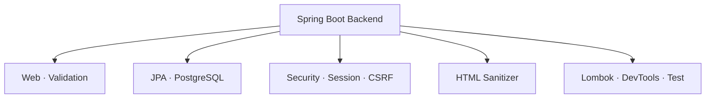

# Backend Dependencies and Build

> 프로젝트: Hyejin Portfolio Backend
>
> 기준 파일: `backend/pom.xml`
>
> 빌드 도구: Maven Wrapper
>
> 문서 상태: 현재 구현 기준

## 1. 문서 목적

이 문서는 Hyejin Portfolio Backend에서 실제로 사용하는 Maven 의존성과 Build Plugin의 역할, Scope, 검증 방법을 정리합니다.

의존성 이름이나 버전이 이 문서와 다를 경우 현재 저장소의 `backend/pom.xml`을 Source of Truth로 사용합니다. Spring Boot Parent가 관리하는 전이 의존성과 개별 버전은 Maven의 실제 해석 결과를 기준으로 확인합니다.

---

## 2. 프로젝트 Build 기준

| 항목 | 현재 구성 |
| --- | --- |
| Group ID | `com.hyejin` |
| Artifact ID | `portfolio` |
| Version | `0.0.1-SNAPSHOT` |
| Java | 17 |
| Spring Boot Parent | 4.1.0 |
| Build Tool | Maven Wrapper |
| Database | PostgreSQL |
| Application Type | Spring Boot REST API |

`SNAPSHOT`은 현재 Artifact가 개발 버전이라는 의미입니다. 실제 운영 배포는 이 문자열만으로 결정하지 않고 Git Commit, Docker Image 및 배포 기록을 함께 사용합니다.

Maven Wrapper를 사용하므로 개발자 PC에 별도의 Maven 버전을 맞춰 설치하기보다 저장소에 포함된 Wrapper로 동일한 Maven 실행 환경을 사용합니다.

---

## 3. 전체 의존성 구성

현재 Backend의 주요 의존성은 다음 책임으로 구분할 수 있습니다.



| 분류 | 의존성 | 주요 역할 |
| --- | --- | --- |
| Web | `spring-boot-starter-web` | Spring MVC와 REST API |
| Persistence | `spring-boot-starter-data-jpa` | Entity, Repository 및 JPA |
| Validation | `spring-boot-starter-validation` | Request DTO 입력 검증 |
| Security | `spring-boot-starter-security` | Session 인증, CSRF 및 URL 접근 제어 |
| Database | `postgresql` | PostgreSQL JDBC Driver |
| HTML Security | `owasp-java-html-sanitizer` | Rich Text HTML 허용 목록 기반 정제 |
| Code Generation | `lombok` | 생성자·Getter 등 반복 코드 생성 |
| Development | `spring-boot-devtools` | 로컬 개발 편의 기능 |
| JPA Test | `spring-boot-starter-data-jpa-test` | JPA 계층 테스트 지원 |
| Validation Test | `spring-boot-starter-validation-test` | Validation 테스트 지원 |
| MVC Test | `spring-boot-starter-webmvc-test` | Controller 및 MVC 테스트 지원 |

---

## 4. Runtime 의존성

### 4.1 Spring Web

`spring-boot-starter-web`은 사용자 API와 관리자 API를 제공하는 Spring MVC 기반 REST 서버의 핵심 의존성입니다.

주요 사용 범위:

- `@RestController`
- URL Mapping
- JSON Request·Response
- Multipart 요청
- 전역 HTTP 처리
- 내장 Servlet Container

Frontend는 Backend API를 호출하고 Backend는 DTO를 JSON으로 반환합니다. Entity를 Controller 응답으로 직접 노출하지 않습니다.

### 4.2 Spring Data JPA

`spring-boot-starter-data-jpa`는 Entity와 PostgreSQL 테이블을 연결하고 Repository 기반 데이터 접근을 제공합니다.

주요 사용 범위:

- Entity Mapping
- 연관관계와 영속성 Context
- `JpaRepository`
- 파생 Query Method
- 트랜잭션 기반 CRUD
- Hibernate Schema 관리

현재 운영 Compose에서는 Spring Profile `prod`와 Hibernate `ddl-auto=update`를 사용합니다. Entity 변경을 운영 Schema에 무검증으로 반영하지 말고, 배포 전에 DB 백업과 Schema 영향 분석을 수행합니다.

JPA의 Cascade와 `orphanRemoval`은 JPA를 통한 Entity 처리 규칙입니다. PostgreSQL FK의 `NO ACTION` 정책과 동일하게 해석하지 않습니다.

### 4.3 Spring Validation

`spring-boot-starter-validation`은 관리자 등록·수정 요청과 로그인 요청 등 외부 입력을 DTO 단계에서 검증합니다.

주요 검증 예:

- 필수 문자열
- 문자열 길이
- Null 허용 여부
- URL·형식 정책
- 숫자 범위
- 중첩 DTO 검증

Validation은 요청 형식 검증을 담당합니다. Slug 중복, 파일 소유관계, 공개 상태 변경과 같은 도메인 규칙은 Service에서 처리합니다.

### 4.4 Spring Security

`spring-boot-starter-security`는 관리자 API의 인증과 요청 보호를 담당합니다.

현재 적용된 방식:

- 서버 Session 인증
- `JSESSIONID` Cookie
- CSRF Token 발급 및 검증
- 관리자 Role 기반 접근 제어
- PasswordEncoder 기반 비밀번호 Hash
- 로그인·로그아웃·현재 사용자 조회

현재 인증 방식은 JWT가 아닙니다. Frontend는 인증 요청에 Cookie가 포함되도록 `credentials`를 사용하고, 상태 변경 요청에는 발급받은 CSRF Header를 전달합니다.

Spring Security를 추가하기 전의 초기 계획이나 모든 요청을 기본 Login Form으로 보호하는 예시는 현재 정책이 아닙니다. 실제 URL 허용 범위는 Security 설정을 기준으로 확인합니다.

### 4.5 PostgreSQL Driver

`postgresql`은 Backend가 PostgreSQL에 연결하기 위한 JDBC Driver입니다.

이 의존성은 일반적으로 Runtime Scope로 사용합니다. 애플리케이션 코드에서 Driver 구현을 직접 호출하기보다 Spring Boot와 DataSource가 실행 시 Driver를 사용합니다.

DB 연결에는 Driver 외에도 다음 설정이 필요합니다.

- JDBC URL
- Database 이름
- 사용자명
- 비밀번호
- Network 접근
- PostgreSQL 실행 상태

실제 접속정보는 `.env` 또는 Git에서 제외된 환경별 설정으로 관리하며 문서와 코드에 평문으로 작성하지 않습니다.

### 4.6 OWASP Java HTML Sanitizer

`owasp-java-html-sanitizer`는 Tiptap 등 Rich Text Editor에서 전달된 HTML을 허용 목록 기반으로 정제하기 위해 사용합니다.

현재 문서화 기준 버전:

```text
20260313.1
```

주요 목적:

- 허용하지 않은 HTML Element 제거
- 위험한 Attribute와 URL Scheme 차단
- 저장형 XSS 위험 감소
- 사용자 화면과 관리자 화면의 Rich Text 안전성 유지

Sanitizer만으로 모든 보안 문제가 해결되는 것은 아닙니다. Spring Security, CSRF, 출력 처리, 파일 검증 및 URL 정책을 함께 유지합니다.

Sanitizer 정책을 변경하면 기존 Rich Text가 어떻게 정제되는지와 Frontend 표시 결과를 함께 검증합니다.

---

## 5. 개발 편의 의존성

### 5.1 Lombok

Lombok은 컴파일 시점에 생성자와 Getter 등 반복 코드를 생성합니다.

주요 사용 예:

- `@Getter`
- `@RequiredArgsConstructor`
- `@NoArgsConstructor`

Entity에 모든 필드를 변경할 수 있는 공개 Setter를 자동 생성하지 않습니다. Entity 생성과 상태 변경은 생성자 또는 의미가 명확한 메서드를 사용합니다.

Maven Compiler Plugin의 Annotation Processor 설정과 IDE의 Annotation Processing 설정이 일치해야 합니다.

Lombok은 최종 실행 Jar에 필요한 Runtime 기능이 아니므로 Spring Boot Maven Plugin에서 제외할 수 있습니다.

### 5.2 Spring Boot DevTools

DevTools는 로컬 개발 중 재시작과 개발 편의 기능을 제공합니다.

현재 용도:

- 로컬 코드 변경 시 재시작 지원
- 개발 과정의 반복 실행 보조
- 개발환경 편의 설정

DevTools는 운영 기능이 아니므로 Runtime·Optional 성격으로 관리하고 운영 Artifact에 의도치 않게 포함되지 않도록 합니다.

---

## 6. 테스트 의존성

현재 `pom.xml`은 테스트 책임에 맞는 Spring Boot Test Starter를 사용합니다.

| 의존성 | 검증 대상 |
| --- | --- |
| `spring-boot-starter-data-jpa-test` | Entity, Repository 및 JPA 관련 테스트 |
| `spring-boot-starter-validation-test` | DTO Validation |
| `spring-boot-starter-webmvc-test` | Controller, MVC 및 HTTP 요청 처리 |

테스트 의존성은 Test Scope로 관리하여 운영 Runtime Classpath에 포함하지 않습니다.

프로젝트에는 Service와 파일 정리 정책 등을 검증하는 테스트가 있으며, Backend 변경 후 전체 테스트를 실행합니다.

문서에서 테스트가 있다고 설명하는 것과 현재 Commit에서 테스트가 실제로 통과했다는 주장은 구분합니다. 테스트 결과를 기록할 때는 실행한 Commit과 명령을 함께 남깁니다.

---

## 7. Scope와 Optional

| 설정 | 의미 | 대표 대상 |
| --- | --- | --- |
| 기본 Compile | 컴파일과 실행에 필요 | Web, JPA, Validation, Security, Sanitizer |
| `runtime` | 컴파일보다 실행 시 필요 | PostgreSQL Driver, DevTools |
| `test` | 테스트 Compile과 실행에서만 필요 | JPA·Validation·MVC Test Starter |
| `optional` | 이 프로젝트를 의존하는 다른 프로젝트로 전파하지 않음 | Lombok, DevTools |

Scope를 임의로 변경하면 Compile Classpath, Runtime Image 또는 Test 실행 결과가 달라질 수 있습니다. 의존성 추가 시 사용 위치와 배포 포함 여부를 먼저 확인합니다.

---

## 8. Build Plugin

### 8.1 Maven Compiler Plugin

Maven Compiler Plugin은 Java 17 코드를 Compile하고 Lombok Annotation Processor를 적용합니다.

확인 항목:

- `java.version`
- Compiler Source·Target 또는 Release
- Lombok Annotation Processor
- CI와 Docker Build의 JDK 버전

IDE에서는 정상인데 Maven Build에서 Lombok 관련 메서드를 찾지 못하면 IDE Plugin보다 Maven Compiler 설정과 Wrapper 실행 결과를 먼저 확인합니다.

### 8.2 Spring Boot Maven Plugin

Spring Boot Maven Plugin은 실행 가능한 Spring Boot Jar를 생성합니다.

주요 역할:

- 실행 가능한 Jar Repackage
- Main Class와 Runtime Classpath 구성
- Spring Boot 애플리케이션 실행 지원
- Docker Image Build에 사용할 Artifact 생성

Lombok은 Compile 시 코드를 생성한 뒤 Runtime에 필요하지 않으므로 최종 Artifact 제외 설정을 유지합니다.

---

## 9. Maven Wrapper 사용

### Git Bash

```bash
cd backend
./mvnw test
```

### Windows PowerShell

```powershell
cd backend
.\mvnw.cmd test
```

### 애플리케이션 실행

Git Bash:

```bash
cd backend
./mvnw spring-boot:run
```

PowerShell:

```powershell
cd backend
.\mvnw.cmd spring-boot:run
```

환경별 DB 설정이 없거나 PostgreSQL이 실행되지 않았다면 애플리케이션 시작 과정에서 DataSource 연결 오류가 발생할 수 있습니다.

---

## 10. 검증 명령

### 10.1 전체 테스트

```bash
cd backend
./mvnw test
```

### 10.2 Clean Verify

```bash
cd backend
./mvnw clean verify
```

`clean verify`는 기존 Build 결과를 제거하고 Compile, Test 및 Maven Lifecycle 검증을 수행합니다.

### 10.3 배포 Artifact 생성

```bash
cd backend
./mvnw clean package
```

테스트를 생략하는 옵션은 앞 단계에서 동일 Commit의 테스트 통과가 확인된 경우에만 사용합니다.

### 10.4 의존성 트리

```bash
cd backend
./mvnw dependency:tree
```

다음 상황에서 의존성 트리를 확인합니다.

- 동일 라이브러리의 서로 다른 버전 충돌
- 예상하지 못한 전이 의존성
- Test Runtime에서 Class를 찾지 못함
- 보안 취약점이 보고된 라이브러리의 실제 포함 여부

---

## 11. Docker Build와 운영

Backend Docker Image는 저장소의 `backend/Dockerfile`을 기준으로 Build합니다. Maven Build 단계와 Java Runtime 단계를 분리하여 최종 Image에 Source와 Build Cache가 불필요하게 포함되지 않도록 합니다.

운영 구조:

```text
Docker Compose
├── db       : PostgreSQL 17
├── backend  : Spring Boot
└── frontend : React 정적 파일 + Nginx
```

Backend는 Docker Network에서 `db:5432`로 PostgreSQL에 접근하고 내부 포트 8081을 사용합니다. Backend 포트는 Host에 직접 공개하지 않으며 Frontend Nginx를 통해 `/api` 요청을 전달받습니다.

운영 환경변수, DB 비밀번호 및 관리자 Bootstrap 인증정보를 Image에 복사하지 않습니다.

---

## 12. 의존성 변경 원칙

새 의존성을 추가하기 전에 다음을 확인합니다.

1. 현재 Spring Boot Starter나 JDK 기능으로 해결할 수 있는가
2. 실제 Runtime 기능인지 Test 또는 Build 전용인지
3. Spring Boot Parent가 버전을 관리하는가
4. 별도 버전 선언이 필요한가
5. 전이 의존성과 충돌하지 않는가
6. 유지보수 상태와 라이선스가 적절한가
7. Docker Image 크기와 시작 시간에 영향을 주는가
8. 보안 취약점과 업데이트 정책을 확인했는가

의존성을 추가한 뒤에는 `pom.xml`만 수정하고 끝내지 않습니다.

- Maven Reload
- 전체 테스트
- 의존성 트리 확인
- Docker Build 영향 확인
- 관련 문서 갱신

버전이 Spring Boot Parent에서 관리되는 Starter에는 특별한 이유 없이 개별 버전을 선언하지 않습니다.

---

## 13. 오류 확인

### 13.1 DataSource 설정 오류

대표 증상:

```text
Failed to configure a DataSource
```

확인 순서:

1. 활성 Spring Profile
2. 환경변수 또는 환경별 설정
3. PostgreSQL 실행 상태
4. JDBC Host와 Port
5. Database와 사용자 권한

### 13.2 Java 버전 불일치

확인 명령:

```bash
java -version
cd backend
./mvnw -version
```

IDE Project SDK뿐 아니라 Maven Wrapper와 Docker Build가 사용하는 JDK도 Java 17 기준과 일치해야 합니다.

### 13.3 Lombok Compile 오류

확인 항목:

- Maven Compiler Plugin
- Annotation Processor 설정
- Lombok 의존성 Scope
- IDE Annotation Processing
- Wrapper를 통한 실제 Compile 결과

### 13.4 의존성 다운로드 오류

네트워크, Maven Central 접근, 로컬 Repository Cache 및 Proxy 설정을 확인합니다. 캐시 전체를 바로 삭제하기보다 오류가 발생한 Artifact와 Maven 출력부터 확인합니다.

### 13.5 Security 적용 후 401·403

- 401: 인증되지 않았거나 Session이 유효하지 않은 상태
- 403: 권한 또는 CSRF 검증이 실패한 상태

Frontend 요청의 Cookie 포함 여부, CSRF Header, 보호 URL Pattern 및 Backend 로그를 함께 확인합니다.

---

## 14. 문서 유지 기준

다음 항목이 변경되면 이 문서도 갱신합니다.

- Java 또는 Spring Boot 버전
- Maven Dependency와 Plugin
- Database Driver
- 인증 방식
- HTML 정제 정책
- 테스트 Starter
- Docker Build 방식

문서만 변경한 경우 Backend Test를 생략할 수 있습니다. 코드나 `pom.xml`을 함께 변경했다면 `./mvnw test` 또는 변경 범위에 맞는 상위 검증을 실행합니다.

---

## 15. 관련 문서

- [Backend 도메인 구조](../architecture/backend-domain-structure.md)
- [데이터베이스 ERD](../db/ERD.md)
- [운영 배포 가이드](../operations/DEPLOYMENT.md)
- [프로젝트 README](../../README.md)

현재 의존성의 최종 선언과 버전은 반드시 `backend/pom.xml`에서 확인합니다.
