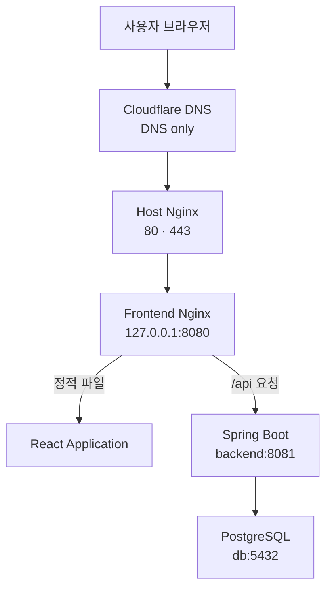

# Portfolio Production Deployment Guide

## 1. 문서 목적

이 문서는 포트폴리오 사이트의 실제 운영 구조와 서버 경로, Docker Compose 실행 방법, 배포 갱신 절차, 데이터 보관 위치, 백업 원칙 및 기본 장애 확인 방법을 기록합니다.

현재 운영 서버에 적용된 구성을 기준으로 작성하며, 앞으로 적용할 권장 설정은 현재 설정과 구분하여 표기합니다.

운영 서버의 비밀번호, SSH 개인키, 관리자 인증정보, 실제 `.env` 값, 공인 IP, 세션 ID 및 CSRF Token은 이 문서와 Git 저장소에 포함하지 않습니다.

---

## 2. 운영 환경

| 항목 | 구성 |
| --- | --- |
| Cloud | AWS Lightsail |
| Region | Seoul (`ap-northeast-2`) |
| OS | Ubuntu 24.04 LTS |
| Domain | `songhyejin.dev` |
| DNS | Cloudflare DNS, 현재 `DNS only` |
| HTTPS | Let’s Encrypt, Certbot |
| Reverse Proxy | Host Nginx |
| Container | Docker, Docker Compose |
| Backend | Java 17, Spring Boot |
| Frontend | React, TypeScript, Vite, Nginx |
| Database | PostgreSQL 17 |

현재 프로젝트는 검증 완료된 `dev` 브랜치를 운영 배포 기준으로 사용합니다. 브랜치 정책을 변경할 경우 이 문서의 배포 명령과 운영 기준도 함께 수정해야 합니다.

> 장기적으로 CI/CD를 구성할 때는 `dev`를 통합 검증 브랜치로 사용하고, `main` 또는 Git Tag를 운영 배포 기준으로 분리하는 방식을 검토합니다.

---

## 3. 운영 아키텍처



Host Nginx는 도메인 요청 처리와 HTTPS 종료를 담당하고 요청을 Frontend 컨테이너로 전달합니다.

Frontend 컨테이너의 Nginx는 React 정적 파일을 제공하며, `/api` 요청을 Docker Network 내부의 `backend:8081`로 전달합니다. Backend는 Docker Network 내부의 `db:5432`를 통해 PostgreSQL에 연결합니다.

외부에는 Host Nginx의 80·443 포트만 공개합니다. Frontend 컨테이너는 Host의 `127.0.0.1:8080`에만 바인딩되어 외부에서 8080 포트로 직접 접근할 수 없습니다. Backend와 PostgreSQL 포트도 외부에 공개하지 않습니다.

### Cloudflare Proxy 관련 주의사항

현재 DNS 레코드는 `DNS only` 상태이므로 브라우저가 Lightsail 서버의 Host Nginx에 직접 연결합니다.

Cloudflare Proxy를 활성화하면 요청 경로가 다음과 같이 변경됩니다.

```text
브라우저 → Cloudflare Proxy → Lightsail Host Nginx
```

Proxy 활성화 시에는 다음 항목을 함께 검토해야 합니다.

- Cloudflare SSL/TLS 암호화 모드
- Origin 인증서 또는 현재 Let’s Encrypt 인증서와의 연결
- Nginx의 실제 Client IP 복원 설정
- Cloudflare IP 대역 신뢰 설정
- 캐시 및 보안 규칙이 관리자 API에 미치는 영향

설정 검증 없이 DNS 레코드의 Proxy 상태만 변경하지 않습니다.

---

## 4. 네트워크와 방화벽

### 4.1 Lightsail 인바운드 규칙

| 포트 | 프로토콜 | 용도 | 권장 허용 범위 |
| ---: | --- | --- | --- |
| 22 | TCP | SSH | 관리자 공인 IP의 `/32` |
| 80 | TCP | HTTP 및 HTTPS Redirect | 모든 IPv4·IPv6 |
| 443 | TCP | HTTPS | 모든 IPv4·IPv6 |

Frontend의 8080, Backend의 8081, PostgreSQL의 5432 포트는 Lightsail 방화벽에 공개하지 않습니다.

SSH 22 포트는 가능하면 관리자 접속 IP로 제한합니다. 인터넷 회선의 공인 IP가 변경되면 새 IP를 다시 등록해야 합니다.

### 4.2 서버 리스닝 포트 확인

```bash
sudo ss -lntp \
  | grep -E ':(22|80|443|8080|8081|5432)[[:space:]]'
```

정상 운영 구조에서 주요 포트는 다음과 같이 확인됩니다.

- Host Nginx: `0.0.0.0:80`, `[::]:80`, `0.0.0.0:443`, `[::]:443`
- Frontend Docker Proxy: `127.0.0.1:8080`
- Backend와 PostgreSQL: Host 공개 포트 없음

---

## 5. 서버 디렉터리

| 경로 | 용도 | Git 포함 여부 |
| --- | --- | --- |
| `/opt/hyejin-portfolio/app` | Git 소스 및 Docker Compose | 소스만 포함 |
| `/opt/hyejin-portfolio/config/.env` | 운영 환경변수 | 제외 |
| `/opt/hyejin-portfolio/data/uploads` | 운영 업로드 파일 | 제외 |
| `/opt/hyejin-portfolio/backups` | 운영 백업 | 제외 |
| `/opt/hyejin-portfolio/migration` | 데이터 이전 작업 파일 | 제외 |
| `/etc/nginx/sites-available/songhyejin.dev` | 도메인 Nginx 설정 | 서버에서 관리 |
| `/etc/letsencrypt/live/songhyejin.dev` | HTTPS 인증서 링크 | 서버에서 관리 |

`.env`, 업로드 파일, DB 덤프, 인증서 개인키 및 마이그레이션 파일은 Git 저장소에 포함하지 않습니다.

### 5.1 권장 권한

운영 환경변수 파일은 최소 권한으로 관리합니다.

```bash
sudo chown ubuntu:ubuntu /opt/hyejin-portfolio/config/.env
sudo chmod 600 /opt/hyejin-portfolio/config/.env
```

권한 확인:

```bash
stat -c '%a %U:%G %n' \
  /opt/hyejin-portfolio/config/.env
```

운영 업로드 디렉터리는 Backend 컨테이너가 읽고 쓸 수 있어야 하며, 불필요한 전체 사용자 쓰기 권한을 부여하지 않습니다. 권한을 변경하기 전에는 컨테이너의 실행 사용자와 기존 파일 소유권을 먼저 확인합니다.

---

## 6. Docker 서비스

| 서비스 | 역할 | 공개 범위 |
| --- | --- | --- |
| `db` | PostgreSQL | Docker 내부 `5432` |
| `backend` | Spring Boot API | Docker 내부 `8081` |
| `frontend` | React 정적 파일 및 API Proxy | Host `127.0.0.1:8080` |

공통 경로 변수:

```bash
APP_DIR="/opt/hyejin-portfolio/app"
ENV_FILE="/opt/hyejin-portfolio/config/.env"
```

서비스 상태 확인:

```bash
docker compose \
  --env-file "$ENV_FILE" \
  -f "$APP_DIR/docker-compose.yml" \
  ps
```

컨테이너 재시작 횟수 확인:

```bash
docker compose \
  --env-file "$ENV_FILE" \
  -f "$APP_DIR/docker-compose.yml" \
  ps -q \
  | xargs -r docker inspect \
      --format '{{.Name}} Status={{.State.Status}} RestartCount={{.RestartCount}} ExitCode={{.State.ExitCode}}'
```

### Docker 데이터 보존 주의사항

- `docker compose stop`: 컨테이너를 정지하지만 삭제하지 않습니다.
- `docker compose down`: 컨테이너와 Compose Network를 삭제하지만 기본적으로 Named Volume은 유지합니다.
- `docker compose down -v`: Named Volume까지 삭제하므로 운영 서버에서 실행하지 않습니다.
- `docker volume rm`: DB 데이터가 영구 삭제될 수 있으므로 운영 서버에서 임의로 실행하지 않습니다.

---

## 7. Nginx와 HTTPS

Host Nginx는 다음 요청을 처리합니다.

- HTTP 80 요청을 동일한 Host의 HTTPS 주소로 이동
- `songhyejin.dev`와 `www.songhyejin.dev` 요청을 모두 처리
- HTTPS 요청을 `127.0.0.1:8080`의 Frontend 컨테이너로 전달
- Client IP와 요청 프로토콜을 Proxy Header로 전달

현재는 두 HTTPS 주소에서 동일한 사이트가 열립니다.

- `https://songhyejin.dev`
- `https://www.songhyejin.dev`

현재 Nginx 설정에는 HTTPS `www.songhyejin.dev` 요청을 `songhyejin.dev`로 보내는 Canonical Redirect가 없습니다. 대표 URL을 하나로 통합하려면 별도의 리디렉션 설정을 적용하고 검증해야 합니다.

### 7.1 Nginx 설정 확인

```bash
sudo nginx -t
systemctl is-active nginx
systemctl is-enabled nginx
```

설정 파일 확인:

```bash
sudo nginx -T \
  | grep -nE 'server_name|listen|proxy_pass|ssl_certificate'
```

### 7.2 HTTPS 인증서 확인

```bash
sudo certbot certificates
systemctl list-timers --all \
  | grep -i certbot
```

인증서 자동 갱신 시험:

```bash
sudo certbot renew --dry-run
```

Certbot이 관리하는 인증서 파일을 직접 편집하거나 복사본으로 교체하지 않습니다.

### 7.3 파일 업로드 크기

Host Nginx에는 파일 업로드 허용 크기를 제한하는 `client_max_body_size`가 설정되어 있습니다.

실제 업로드 가능 크기는 다음 제한 중 가장 작은 값의 영향을 받습니다.

- Host Nginx의 `client_max_body_size`
- Frontend Nginx 설정
- Spring Boot multipart 설정

업로드 제한을 변경할 때는 관련 설정을 함께 확인하고 이미지 및 Resume PDF 업로드를 다시 시험합니다.

---

## 8. 일반 배포 갱신 절차

### 8.1 배포 전 원칙

- 운영 서버에서 소스 파일을 직접 수정하지 않습니다.
- Git 변경사항이 발견되면 원인을 확인하기 전까지 배포를 중단합니다.
- `.env`, DB Volume 및 uploads 디렉터리를 삭제하지 않습니다.
- DB 스키마 또는 데이터 변경이 포함된 배포는 먼저 백업합니다.
- 배포할 Commit Hash를 기록합니다.

### 8.2 Git 상태 확인

```bash
cd /opt/hyejin-portfolio/app

git status --short --branch
git fetch origin
```

`git status --short`에 수정·삭제·추가 파일이 표시되면 배포를 계속하지 않습니다. 운영 서버의 변경사항을 임의로 `restore`, `reset` 또는 삭제하지 말고 원인을 먼저 확인합니다.

현재 운영 기준 브랜치인 `dev`를 최신 상태로 갱신합니다.

```bash
git switch dev
git pull --ff-only origin dev

git status --short --branch
git log -1 --oneline --decorate
```

배포 대상 Commit을 기록합니다.

```bash
DEPLOY_COMMIT="$(git rev-parse HEAD)"
echo "Deploy commit: $DEPLOY_COMMIT"
```

### 8.3 Compose 설정 검증

```bash
APP_DIR="/opt/hyejin-portfolio/app"
ENV_FILE="/opt/hyejin-portfolio/config/.env"

docker compose \
  --env-file "$ENV_FILE" \
  -f "$APP_DIR/docker-compose.yml" \
  config --quiet
```

`config --quiet`가 아무 오류 없이 종료되어야 다음 단계로 진행합니다. 설정 출력 전체를 외부에 공유하면 치환된 환경변수가 노출될 수 있으므로 주의합니다.

### 8.4 이미지 빌드

```bash
docker compose \
  --env-file "$ENV_FILE" \
  -f "$APP_DIR/docker-compose.yml" \
  build backend frontend
```

빌드 결과에 `Built` 또는 정상 종료가 표시되고 오류가 없어야 합니다.

### 8.5 서비스 반영

```bash
docker compose \
  --env-file "$ENV_FILE" \
  -f "$APP_DIR/docker-compose.yml" \
  up -d
```

### 8.6 상태와 로그 확인

```bash
docker compose \
  --env-file "$ENV_FILE" \
  -f "$APP_DIR/docker-compose.yml" \
  ps

docker compose \
  --env-file "$ENV_FILE" \
  -f "$APP_DIR/docker-compose.yml" \
  logs --tail=150 backend frontend
```

다음 항목을 확인합니다.

- DB가 `healthy`
- Backend와 Frontend가 `running`
- 반복 재시작 없음
- Backend 로그에 Application 시작 완료
- Nginx 설정 오류 없음
- 예외와 DB 연결 오류 없음

---

## 9. 배포 후 검증

### 9.1 HTTP와 HTTPS

```bash
curl -sS -o /dev/null \
  -w 'HTTP root → %{http_code} %{redirect_url}\n' \
  http://songhyejin.dev/

curl -sS -o /dev/null \
  -w 'HTTPS root → %{http_code}\n' \
  https://songhyejin.dev/

curl -sS -o /dev/null \
  -w 'HTTPS www → %{http_code}\n' \
  https://www.songhyejin.dev/
```

정상 기준:

- HTTP는 HTTPS로 Redirect
- 두 HTTPS 주소는 정상 응답
- 대표 홈페이지는 HTTP 200

### 9.2 공개 페이지와 API

```bash
curl -sS -o /dev/null \
  -w 'Work page → HTTP %{http_code}\n' \
  https://songhyejin.dev/work

curl -sS -o /dev/null \
  -w 'Research API → HTTP %{http_code}\n' \
  https://songhyejin.dev/api/research
```

### 9.3 관리자 기능

브라우저에서 다음 항목을 확인합니다.

1. 관리자 로그인
2. 관리자 프로젝트 목록 조회
3. 기존 프로젝트 수정
4. 테스트 프로젝트 등록 및 삭제
5. 이미지 업로드와 표시
6. 로그아웃
7. 로그아웃 후 보호된 관리자 API 접근 차단

운영 데이터에 영향을 주는 시험 항목은 테스트 완료 후 정리합니다.

---

## 10. 운영 데이터 저장

### 10.1 PostgreSQL

PostgreSQL 데이터는 Docker Named Volume에 저장합니다. 컨테이너가 재생성되어도 Named Volume을 삭제하지 않는 한 DB 데이터는 유지됩니다.

Volume 확인:

```bash
docker volume ls

docker compose \
  --env-file "$ENV_FILE" \
  -f "$APP_DIR/docker-compose.yml" \
  config --volumes
```

### 10.2 업로드 파일

업로드 파일은 다음 Host 경로에 저장합니다.

```text
/opt/hyejin-portfolio/data/uploads
```

주요 하위 디렉터리:

```text
profile/
projects/
resumes/
skills/
```

프로젝트 이미지, 프로필 이미지, Resume PDF 및 Skill 로고는 DB의 URL과 실제 uploads 파일이 함께 존재해야 정상적으로 표시됩니다.

파일 수와 용량 확인:

```bash
UPLOADS_DIR="/opt/hyejin-portfolio/data/uploads"

find "$UPLOADS_DIR" -type f \
  | wc -l

du -sh "$UPLOADS_DIR"
```

---

## 11. 관리자 Bootstrap 정보

최초 관리자 계정 생성이 완료된 후 운영 `.env`에서 관리자 Bootstrap 사용자명과 비밀번호를 제거하고 Backend 컨테이너를 재생성했습니다.

기존 관리자 계정은 PostgreSQL의 `admin_users` 테이블에 암호화된 비밀번호 Hash로 저장되므로 Bootstrap 환경변수를 제거해도 로그인할 수 있습니다.

운영 원칙:

- 초기 관리자 비밀번호를 Git에 기록하지 않습니다.
- Bootstrap 인증정보를 상시 환경변수로 유지하지 않습니다.
- DB의 비밀번호 Hash를 로그인 비밀번호로 사용할 수 없습니다.
- 관리자 계정 상태가 비활성화되면 올바른 비밀번호를 입력해도 로그인할 수 없습니다.
- 관리자 비밀번호 변경 기능을 추가하기 전에는 운영 절차와 백업 기준을 먼저 정의합니다.

---

## 12. 운영 백업 원칙

완전한 운영 백업에는 다음 두 항목이 모두 필요합니다.

1. PostgreSQL 전체 Custom Format 덤프
2. `/opt/hyejin-portfolio/data/uploads` 전체 압축

DB 덤프만 백업하면 이미지와 PDF를 복구할 수 없고, uploads만 백업하면 콘텐츠 관계와 URL 정보를 복구할 수 없습니다.

### 12.1 백업 전 확인

```bash
docker compose \
  --env-file "$ENV_FILE" \
  -f "$APP_DIR/docker-compose.yml" \
  ps

df -h /opt/hyejin-portfolio
```

### 12.2 수동 DB 백업 예시

```bash
BACKUP_ROOT="/opt/hyejin-portfolio/backups"
BACKUP_DATE="$(date +%Y%m%d-%H%M%S)"
BACKUP_DIR="$BACKUP_ROOT/$BACKUP_DATE"

mkdir -p "$BACKUP_DIR"

docker compose \
  --env-file "$ENV_FILE" \
  -f "$APP_DIR/docker-compose.yml" \
  exec -T db \
  sh -c 'pg_dump \
    -U "$POSTGRES_USER" \
    -d "$POSTGRES_DB" \
    --format=custom \
    --no-owner \
    --no-privileges' \
  > "$BACKUP_DIR/portfolio-db.dump"
```

### 12.3 수동 uploads 백업 예시

```bash
UPLOADS_DIR="/opt/hyejin-portfolio/data/uploads"

tar \
  --create \
  --gzip \
  --file="$BACKUP_DIR/portfolio-uploads.tar.gz" \
  --directory="$UPLOADS_DIR" \
  .
```

### 12.4 Checksum 생성

```bash
cd "$BACKUP_DIR"

sha256sum \
  portfolio-db.dump \
  portfolio-uploads.tar.gz \
  > SHA256SUMS

sha256sum -c SHA256SUMS
```

백업 파일은 생성 성공 메시지만 확인하지 말고 파일 크기, DB Archive 목록 및 압축 파일 목록을 함께 확인합니다.

```bash
ls -lh "$BACKUP_DIR"

docker compose \
  --env-file "$ENV_FILE" \
  -f "$APP_DIR/docker-compose.yml" \
  exec -T db \
  pg_restore -l \
  < "$BACKUP_DIR/portfolio-db.dump" \
  | sed -n '1,40p'

tar -tzf "$BACKUP_DIR/portfolio-uploads.tar.gz" \
  | sed -n '1,40p'
```

### 12.5 자동 백업 상태

현재 운영 DB와 uploads의 자동 백업은 별도 구성 대상입니다. 자동 백업이 실제로 구성되고 복원 시험까지 완료되기 전에는 이 문서에서 “운영 완료”로 표시하지 않습니다.

자동 백업을 구성할 때는 다음 항목을 결정해야 합니다.

- 실행 주기
- 보관 기간
- 서버 외부 저장 위치
- 암호화 여부
- 실패 알림
- 정기 복원 시험

---

## 13. 복구와 롤백 원칙

### 13.1 애플리케이션 롤백

애플리케이션 롤백은 이전 Git Commit의 소스와 Docker 이미지를 다시 배포하는 작업입니다. DB 데이터 복구와는 다른 작업입니다.

롤백 전에 다음 내용을 확인합니다.

- 현재 배포 Commit
- 이전 정상 Commit
- DB 스키마 호환성
- 롤백 전 운영 데이터 백업
- uploads 변경 여부

운영 서버에서 임의로 `git reset --hard`를 실행하지 않습니다. 이전 정상 Commit을 기준으로 별도 배포 브랜치나 검증된 절차를 사용합니다.

### 13.2 DB 및 uploads 복구

DB 복구와 uploads 덮어쓰기는 현재 운영 데이터를 변경하거나 제거할 수 있는 파괴적 작업입니다. 백업 파일의 Checksum, 대상 DB, 복구 범위 및 현재 데이터 보관 여부를 확인한 뒤 별도 복구 절차에 따라 수행합니다.

운영 장애 상황에서 다음 명령을 즉시 실행하지 않습니다.

- `docker compose down -v`
- `docker volume rm ...`
- 검증되지 않은 `pg_restore --clean`
- uploads 디렉터리 전체 삭제
- 백업 파일을 이용한 무확인 덮어쓰기

복원 명령은 운영 데이터 보호를 위해 이 기본 배포 문서에서 자동 실행 형태로 제공하지 않습니다. 복구 시점의 장애 범위와 백업 상태를 확인한 뒤 별도 Runbook으로 진행합니다.

---

## 14. 기본 장애 확인

### 14.1 홈페이지에 접속할 수 없는 경우

```bash
nslookup songhyejin.dev 1.1.1.1
nslookup www.songhyejin.dev 1.1.1.1

sudo nginx -t
systemctl status nginx --no-pager

sudo ss -lntp \
  | grep -E ':(80|443|8080)[[:space:]]'
```

확인 순서:

1. DNS가 운영 서버를 가리키는지 확인
2. Lightsail 방화벽의 80·443 허용 확인
3. Host Nginx 상태 확인
4. Frontend가 `127.0.0.1:8080`에 리스닝 중인지 확인
5. HTTPS 인증서 상태 확인

### 14.2 HTTP 502가 발생하는 경우

```bash
docker compose \
  --env-file "$ENV_FILE" \
  -f "$APP_DIR/docker-compose.yml" \
  ps frontend

curl -sS -o /dev/null \
  -w 'Frontend upstream → HTTP %{http_code}\n' \
  http://127.0.0.1:8080/

sudo tail -n 100 \
  /var/log/nginx/error.log
```

Host Nginx는 정상이지만 Frontend 컨테이너가 정지했거나 8080 바인딩이 없으면 502가 발생할 수 있습니다.

### 14.3 API 오류가 발생하는 경우

```bash
docker compose \
  --env-file "$ENV_FILE" \
  -f "$APP_DIR/docker-compose.yml" \
  ps db backend

docker compose \
  --env-file "$ENV_FILE" \
  -f "$APP_DIR/docker-compose.yml" \
  logs --tail=200 db backend
```

확인 항목:

- DB Healthcheck 통과 여부
- Backend 재시작 여부
- PostgreSQL 연결 오류
- 필수 환경변수 누락
- Spring Boot 시작 실패
- Frontend Nginx의 `/api` Proxy 설정

### 14.4 이미지 또는 PDF가 보이지 않는 경우

확인 항목:

1. DB에 저장된 URL 확인
2. uploads Host 경로에 실제 파일 존재 여부 확인
3. Backend 컨테이너의 Bind Mount 확인
4. 파일과 상위 디렉터리 권한 확인
5. 요청 URL의 HTTP 상태 확인

```bash
BACKEND_ID="$(docker compose \
  --env-file "$ENV_FILE" \
  -f "$APP_DIR/docker-compose.yml" \
  ps -q backend)"

docker inspect "$BACKEND_ID" \
  --format '{{range .Mounts}}{{println .Source "->" .Destination}}{{end}}'
```

---

## 15. 최초 배포 완료 내역

다음 항목을 실제 운영 환경에서 확인했습니다.

- Lightsail 고정 IP 연결
- Ubuntu 시스템 업데이트와 재부팅 후 Kernel 반영
- KST 시간대와 NTP 동기화
- 2GB Swap 구성과 재부팅 후 활성화
- Docker 및 Docker Compose 설치
- Docker 서비스 `active/enabled`
- Docker 로그 드라이버 `local`
- Git `dev` 브랜치 복제
- PostgreSQL 컨테이너 Healthcheck 통과
- Backend 실행과 DB 테이블 생성
- Frontend Nginx 실행
- Host Nginx Reverse Proxy 구성
- 도메인 DNS 연결
- Let’s Encrypt HTTPS 인증서 발급
- Certbot 자동 갱신 Timer 및 Dry Run 확인
- 관리자 Session 인증과 CSRF 보호
- 관리자 로그인과 로그아웃
- 관리자 프로젝트 등록·수정·삭제
- 관리자 Bootstrap 인증정보 제거
- 기존 DB 콘텐츠 복원
- 기존 업로드 이미지와 Resume PDF 복원
- 신규 프로젝트 등록
- 공개 홈페이지 및 API HTTP 200 응답

현재 자동 운영 백업은 위 완료 내역에 포함하지 않습니다.

---

## 16. 운영 URL

- 대표 URL: <https://songhyejin.dev>
- 보조 URL: <https://www.songhyejin.dev>

현재 두 URL 모두 동일한 사이트를 제공합니다. 향후 Canonical Redirect를 적용하면 대표 URL 정책과 Nginx 설정을 함께 갱신합니다.

---

## 17. 관련 문서

- 프로젝트 개요: [../../README.md](../../README.md)
- 데이터베이스 구조: [../db/ERD.md](../db/ERD.md)

문서의 명령과 경로는 현재 운영 구성을 기준으로 합니다. 서버 구조, 도메인, 브랜치 정책, Compose 파일 또는 데이터 저장 경로를 변경하면 이 문서도 같은 배포 작업에서 함께 갱신합니다.
