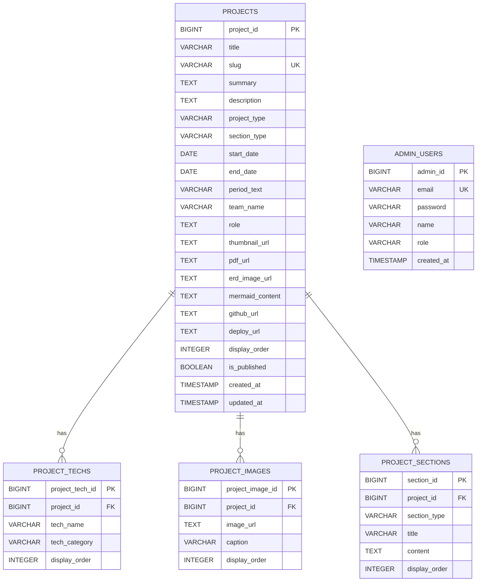

# Portfolio DB ERD V1

> 프로젝트: Hyejin Portfolio Site  
> 문서명: Portfolio DB ERD V1  
> 기준: Spring Boot JPA Entity 기반 설계  
> DB: PostgreSQL  
> 작성 목적: 실제 Entity 구현 전, 전체 DB 구조와 관계를 먼저 확정하기 위한 백업 문서

---

## 01. V1 DB 설계 목표

이번 포트폴리오 사이트의 DB는 단순히 카드 목록만 저장하는 구조가 아니라, 다음 화면과 기능을 모두 지원할 수 있도록 설계한다.

```txt
Work 메인 페이지
프로젝트 상세 페이지
관리자 프로젝트 등록/수정
이미지/PDF/ERD/Mermaid 자료 관리
추후 관리자 로그인
```

따라서 중심 테이블은 `projects`이며, 프로젝트에 종속되는 기술스택, 이미지, 상세 섹션은 별도 테이블로 분리한다.

---

## 02. 전체 ERD 개요



---

## 03. 테이블 관계 요약

| 부모 테이블 | 자식 테이블 | 관계 | 의미 |
|---|---|---|---|
| `projects` | `project_techs` | 1:N | 하나의 프로젝트는 여러 기술스택을 가질 수 있다. |
| `projects` | `project_images` | 1:N | 하나의 프로젝트는 여러 상세 이미지를 가질 수 있다. |
| `projects` | `project_sections` | 1:N | 하나의 프로젝트는 여러 상세 설명 섹션을 가질 수 있다. |
| `admin_users` | 없음 | 독립 | 관리자 로그인/인증용 테이블이다. |

---

## 04. V1 테이블 목록

```txt
projects
project_techs
project_images
project_sections
admin_users
```

V1에서 가장 먼저 구현할 대상은 다음이다.

```txt
ProjectType
SectionType
ProjectEntity
ProjectRepository
```

그 다음 순서로 `ProjectTechEntity`, `ProjectImageEntity`, `ProjectSectionEntity`, `AdminUserEntity`를 확장한다.

---

## 05. projects 테이블

`projects`는 포트폴리오 사이트의 중심 테이블이다.

Work 메인 카드, 프로젝트 상세 페이지, 관리자 프로젝트 목록/등록/수정 기능이 모두 이 테이블을 기준으로 동작한다.

### 05-1. Entity 매핑

```txt
Entity: ProjectEntity
Table: projects
```

### 05-2. 컬럼 정의

| 컬럼명 | 타입 | 제약 | Entity 필드명 | 역할 |
|---|---|---|---|---|
| `project_id` | BIGINT | PK | `projectId` | 프로젝트 고유 ID |
| `title` | VARCHAR(200) | NOT NULL | `title` | 프로젝트명 |
| `slug` | VARCHAR(200) | NOT NULL, UNIQUE | `slug` | 상세 페이지 URL 식별자 |
| `summary` | TEXT | NOT NULL | `summary` | Work 카드용 한줄 설명 |
| `description` | TEXT | NULL | `description` | 프로젝트 상세 설명 |
| `project_type` | VARCHAR(50) | NOT NULL | `projectType` | 프로젝트 성격 구분 |
| `section_type` | VARCHAR(50) | NOT NULL | `sectionType` | Work 메인 노출 영역 구분 |
| `start_date` | DATE | NULL | `startDate` | 프로젝트 시작일 |
| `end_date` | DATE | NULL | `endDate` | 프로젝트 종료일 |
| `period_text` | VARCHAR(100) | NULL | `periodText` | 화면 표시용 기간 문구 |
| `team_name` | VARCHAR(200) | NULL | `teamName` | 팀명 또는 진행 구분 |
| `role` | TEXT | NULL | `role` | 본인 담당 영역 |
| `thumbnail_url` | TEXT | NULL | `thumbnailUrl` | 대표 이미지 URL |
| `pdf_url` | TEXT | NULL | `pdfUrl` | 팀프로젝트 PDF 링크 |
| `erd_image_url` | TEXT | NULL | `erdImageUrl` | ERD 이미지 URL |
| `mermaid_content` | TEXT | NULL | `mermaidContent` | Mermaid 워크플로우 내용 |
| `github_url` | TEXT | NULL | `githubUrl` | GitHub Repository URL |
| `deploy_url` | TEXT | NULL | `deployUrl` | 배포 URL |
| `display_order` | INTEGER | NOT NULL | `displayOrder` | 관리자 지정 노출 순서 |
| `is_published` | BOOLEAN | NOT NULL | `published` | 사용자 화면 공개 여부 |
| `created_at` | TIMESTAMP | NOT NULL | `createdAt` | 생성일 |
| `updated_at` | TIMESTAMP | NOT NULL | `updatedAt` | 수정일 |

### 05-3. 주요 설계 결정

#### slug

`slug`는 프로젝트 상세 페이지 URL에 사용한다.

예시:

```txt
/work/corework
/work/matchimnae
/work/portfolio-site
```

따라서 중복되면 안 되므로 UNIQUE 제약을 둔다.

#### project_type

프로젝트의 성격을 나타낸다.

```txt
TEAM
PERSONAL
DESIGN
GUIDE
EXPERIMENT
```

#### section_type

Work 메인에서 어느 섹션에 노출할지 결정한다.

```txt
TEAM
MORE
```

#### published

Java 필드명은 `published`, DB 컬럼명은 `is_published`로 사용한다.

권장 Entity 매핑:

```java
@Column(name = "is_published", nullable = false)
private boolean published;
```

이렇게 하는 이유는 Java에서 `Boolean isPublished`처럼 작성하면 Lombok, Jackson, JPA 조합에서 getter 이름이 애매해질 수 있기 때문이다.

---

## 06. project_techs 테이블

`project_techs`는 프로젝트별 기술스택을 관리한다.

기술스택을 `projects` 테이블의 문자열 컬럼 하나로 저장하지 않고 별도 테이블로 분리한다.

### 06-1. Entity 매핑

```txt
Entity: ProjectTechEntity
Table: project_techs
```

### 06-2. 컬럼 정의

| 컬럼명 | 타입 | 제약 | Entity 필드명 | 역할 |
|---|---|---|---|---|
| `project_tech_id` | BIGINT | PK | `projectTechId` | 기술스택 고유 ID |
| `project_id` | BIGINT | FK, NOT NULL | `project` | 연결된 프로젝트 |
| `tech_name` | VARCHAR(100) | NOT NULL | `techName` | 기술명 |
| `tech_category` | VARCHAR(100) | NULL | `techCategory` | 기술 분류 |
| `display_order` | INTEGER | NOT NULL | `displayOrder` | 기술스택 표시 순서 |

### 06-3. 예시 데이터

| project_id | tech_name | tech_category | display_order |
|---:|---|---|---:|
| 1 | Spring Boot | Backend | 1 |
| 1 | React | Frontend | 2 |
| 1 | PostgreSQL | Database | 3 |
| 1 | PGVector | AI | 4 |
| 1 | Docker | Infra | 5 |

### 06-4. 분리 이유

```txt
프로젝트마다 기술스택 개수가 다르다.
Frontend / Backend / Database / AI / Infra 등 카테고리 분류가 가능하다.
기술스택 표시 순서를 따로 관리할 수 있다.
상세 페이지에서 태그 UI로 보여주기 쉽다.
```

---

## 07. project_images 테이블

`project_images`는 프로젝트 상세 페이지에 들어갈 여러 이미지를 관리한다.

대표 이미지는 `projects.thumbnail_url`에 저장하고, 상세 이미지 여러 장은 `project_images`에서 관리한다.

### 07-1. Entity 매핑

```txt
Entity: ProjectImageEntity
Table: project_images
```

### 07-2. 컬럼 정의

| 컬럼명 | 타입 | 제약 | Entity 필드명 | 역할 |
|---|---|---|---|---|
| `project_image_id` | BIGINT | PK | `projectImageId` | 프로젝트 이미지 고유 ID |
| `project_id` | BIGINT | FK, NOT NULL | `project` | 연결된 프로젝트 |
| `image_url` | TEXT | NOT NULL | `imageUrl` | 이미지 URL |
| `caption` | VARCHAR(300) | NULL | `caption` | 이미지 설명 |
| `display_order` | INTEGER | NOT NULL | `displayOrder` | 이미지 표시 순서 |

### 07-3. 예시 데이터

| project_id | image_url | caption | display_order |
|---:|---|---|---:|
| 1 | `/uploads/corework-main.png` | COREWORK 메인 화면 | 1 |
| 1 | `/uploads/corework-admin.png` | 관리자 RAG 문서 관리 화면 | 2 |
| 1 | `/uploads/corework-chatbot.png` | AI 챗봇 화면 | 3 |

---

## 08. project_sections 테이블

`project_sections`는 프로젝트 상세 페이지의 텍스트 섹션을 유연하게 관리한다.

프로젝트마다 상세 페이지 구성은 조금씩 달라질 수 있으므로, 섹션을 컬럼으로 고정하지 않고 별도 테이블로 분리한다.

### 08-1. Entity 매핑

```txt
Entity: ProjectSectionEntity
Table: project_sections
```

### 08-2. 컬럼 정의

| 컬럼명 | 타입 | 제약 | Entity 필드명 | 역할 |
|---|---|---|---|---|
| `section_id` | BIGINT | PK | `sectionId` | 섹션 고유 ID |
| `project_id` | BIGINT | FK, NOT NULL | `project` | 연결된 프로젝트 |
| `section_type` | VARCHAR(100) | NOT NULL | `sectionType` | 상세 섹션 유형 |
| `title` | VARCHAR(200) | NULL | `title` | 섹션 제목 |
| `content` | TEXT | NULL | `content` | 섹션 본문 |
| `display_order` | INTEGER | NOT NULL | `displayOrder` | 섹션 표시 순서 |

### 08-3. 예상 section_type 값

```txt
OVERVIEW
MY_ROLE
TECH_STACK
KEY_FEATURES
ARCHITECTURE
DATABASE_ERD
WORKFLOW
TROUBLESHOOTING
RESULT
LINKS
```

### 08-4. 예시 데이터

| project_id | section_type | title | display_order |
|---:|---|---|---:|
| 1 | OVERVIEW | 프로젝트 개요 | 1 |
| 1 | MY_ROLE | 담당 역할 | 2 |
| 1 | TROUBLESHOOTING | 문제 해결 | 3 |
| 1 | RESULT | 결과 및 회고 | 4 |

---

## 09. admin_users 테이블

`admin_users`는 관리자 로그인과 인증을 위한 테이블이다.

V1에서는 프로젝트 중심 구조를 먼저 만들고, 관리자 기능 구현 단계에서 추가한다.

### 09-1. Entity 매핑

```txt
Entity: AdminUserEntity
Table: admin_users
```

### 09-2. 컬럼 정의

| 컬럼명 | 타입 | 제약 | Entity 필드명 | 역할 |
|---|---|---|---|---|
| `admin_id` | BIGINT | PK | `adminId` | 관리자 고유 ID |
| `email` | VARCHAR(200) | NOT NULL, UNIQUE | `email` | 관리자 로그인 이메일 |
| `password` | VARCHAR(255) | NOT NULL | `password` | BCrypt 암호화 비밀번호 |
| `name` | VARCHAR(100) | NOT NULL | `name` | 관리자 이름 |
| `role` | VARCHAR(50) | NOT NULL | `role` | 관리자 권한 |
| `created_at` | TIMESTAMP | NOT NULL | `createdAt` | 생성일 |

### 09-3. 보안 주의사항

```txt
password는 절대 평문으로 저장하지 않는다.
나중에 Spring Security + BCrypt로 암호화한다.
관리자 인증은 JWT 방식으로 확장한다.
```

---

## 10. JPA Entity 관계 설계

### 10-1. ProjectEntity 기준 관계

최종적으로 `ProjectEntity`는 다음 관계를 가진다.

```java
@OneToMany(mappedBy = "project", cascade = CascadeType.ALL, orphanRemoval = true)
private List<ProjectTechEntity> techStacks = new ArrayList<>();

@OneToMany(mappedBy = "project", cascade = CascadeType.ALL, orphanRemoval = true)
private List<ProjectImageEntity> images = new ArrayList<>();

@OneToMany(mappedBy = "project", cascade = CascadeType.ALL, orphanRemoval = true)
private List<ProjectSectionEntity> sections = new ArrayList<>();
```

### 10-2. 자식 Entity 기준 관계

자식 Entity들은 공통적으로 `ProjectEntity`를 참조한다.

```java
@ManyToOne(fetch = FetchType.LAZY)
@JoinColumn(name = "project_id", nullable = false)
private ProjectEntity project;
```

### 10-3. LAZY 사용 이유

`ManyToOne` 관계에는 `FetchType.LAZY`를 사용한다.

이유:

```txt
불필요한 조인을 줄일 수 있다.
상세 조회와 목록 조회의 데이터 양을 분리할 수 있다.
성능 문제를 줄일 수 있다.
```

주의:

```txt
LAZY 관계를 그대로 Controller에서 반환하면 Lazy Loading 문제가 발생할 수 있다.
따라서 Entity 직접 반환 금지, DTO 변환 필수.
```

---

## 11. API 조회 기준

### 11-1. Work Team Project 목록

```txt
GET /api/projects?sectionType=TEAM
```

조회 조건:

```txt
section_type = TEAM
is_published = true
```

정렬 기준:

```txt
start_date DESC
display_order ASC 또는 최신순 우선
```

### 11-2. More stuff 목록

```txt
GET /api/projects?sectionType=MORE
```

조회 조건:

```txt
section_type = MORE
is_published = true
```

### 11-3. 프로젝트 상세

```txt
GET /api/projects/{slug}
```

조회 조건:

```txt
slug = 요청 slug
is_published = true
```

상세 응답에는 추후 다음 데이터를 포함한다.

```txt
project 기본 정보
techStacks
images
sections
pdfUrl
erdImageUrl
mermaidContent
githubUrl
deployUrl
```

---

## 12. V1 구현 우선순위

한 번에 모든 테이블을 만들지 않는다.

JPA 관계 매핑은 오류 추적이 어려울 수 있으므로 작은 단위로 진행한다.

### 12-1. 1차

```txt
ProjectType
SectionType
ProjectEntity
ProjectRepository
```

목표:

```txt
projects 테이블 자동 생성 확인
Repository 메서드명 오류 확인
```

### 12-2. 2차

```txt
ProjectListResponseDto
ProjectDetailResponseDto
ProjectService
ProjectController
```

목표:

```txt
프로젝트 목록/상세 공개 API 확인
```

### 12-3. 3차

```txt
ProjectTechEntity
ProjectImageEntity
ProjectSectionEntity
```

목표:

```txt
프로젝트 상세 페이지 확장 데이터 구조 완성
```

### 12-4. 4차

```txt
ProjectCreateRequestDto
ProjectUpdateRequestDto
AdminProjectController
```

목표:

```txt
관리자 프로젝트 등록/수정 API 구현
```

### 12-5. 5차

```txt
AdminUserEntity
AdminAuthController
AdminAuthService
Spring Security
JWT
```

목표:

```txt
관리자 로그인 및 인증 구현
```

---

## 13. V1 주의사항

### 13-1. Entity 직접 반환 금지

Controller에서 Entity를 직접 반환하지 않는다.

나쁜 예:

```java
@GetMapping("/api/projects")
public List<ProjectEntity> getProjects() {
    return projectRepository.findAll();
}
```

좋은 예:

```java
@GetMapping("/api/projects")
public List<ProjectListResponseDto> getProjects() {
    return projectService.getProjects();
}
```

---

### 13-2. boolean 필드명 주의

DB 컬럼명은 `is_published`로 두되, Java 필드명은 `published`로 둔다.

권장:

```java
@Column(name = "is_published")
private boolean published;
```

Repository 메서드명:

```java
findBySlugAndPublishedTrue(String slug)
```

비권장:

```java
private Boolean isPublished;
findBySlugAndIsPublishedTrue(String slug)
```

---

### 13-3. application-local.yml Git 제외

DB 비밀번호가 들어가는 `application-local.yml`은 GitHub에 올리지 않는다.

루트 `.gitignore`에 아래를 포함한다.

```gitignore
backend/src/main/resources/application-local.yml
```

---

### 13-4. ddl-auto 설정

개발 단계:

```yml
spring:
  jpa:
    hibernate:
      ddl-auto: update
```

운영 단계:

```yml
spring:
  jpa:
    hibernate:
      ddl-auto: validate
```

운영에서 `update`를 계속 사용하면 Entity 변경이 DB 구조에 예상치 않게 반영될 수 있다.

---

### 13-5. 관계 Entity는 단계적으로 추가

처음부터 모든 관계를 연결하지 않는다.

권장 흐름:

```txt
ProjectEntity 단독 생성
↓
projects 테이블 확인
↓
ProjectRepository 확인
↓
ProjectTechEntity / ProjectImageEntity / ProjectSectionEntity 추가
```

---

## 14. 최종 V1 결론

V1 DB 구조는 다음 기준으로 확정한다.

```txt
projects를 중심 테이블로 둔다.
기술스택, 이미지, 상세 섹션은 projects의 자식 테이블로 분리한다.
관리자 계정은 admin_users 독립 테이블로 둔다.
JPA Entity 기반으로 테이블을 생성한다.
API 응답에는 Entity를 직접 반환하지 않고 DTO를 사용한다.
```

V1의 가장 중요한 구현 시작점은 다음이다.

```txt
ProjectType
SectionType
ProjectEntity
ProjectRepository
```

이 네 가지를 먼저 만들고, `projects` 테이블이 PostgreSQL에 정상 생성되는지 확인한다.
