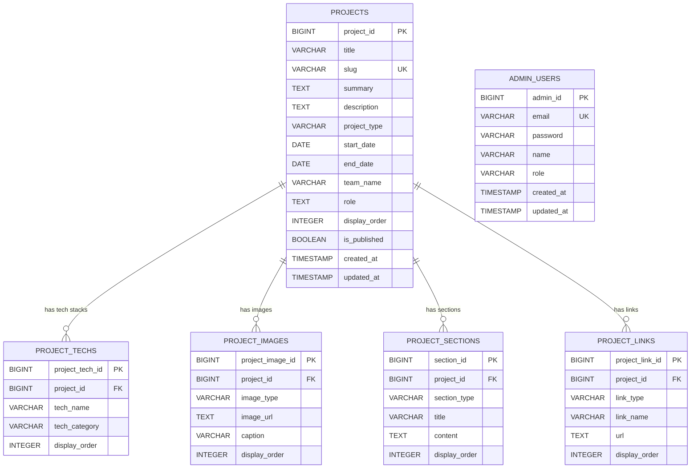

# Portfolio DB ERD V1.1

> 프로젝트: Hyejin Portfolio Site  
> 기준: Spring Boot JPA Entity 기반 PostgreSQL 설계  
> 목적: Entity 구현 전 DB 구조와 관계를 확정하기 위한 V1.1 설계 문서  
> 변경 핵심: `projects`는 핵심 정보만 유지하고, URL/이미지/상세섹션은 자식 테이블로 분리한다.

---

## 01. V1.1 핵심 변경 사항

V1에서 검토했던 구조를 기준으로 아래처럼 정리한다.

```txt
제거:
- projects.section_type
- projects.period_text
- projects.thumbnail_url
- projects.pdf_url
- projects.erd_image_url
- projects.mermaid_content
- projects.github_url
- projects.deploy_url

유지:
- projects.slug

추가:
- project_links
- project_images.image_type
- ProjectImageType Enum
- ProjectSectionType Enum
- ProjectLinkType Enum
```

---

## 02. 설계 판단

### 02-1. `slug`는 `projects`에 유지

`slug`는 외부 URL이 아니라 프로젝트 상세 페이지를 찾기 위한 내부 식별자이다.

예시:

```txt
/work/corework
/work/matchimnae
/work/portfolio-site
```

따라서 `slug`는 `project_links`로 보내지 않고 `projects`에 둔다.

```txt
projects.slug 유지
project_links로 이동하지 않음
```

---

### 02-2. `period_text` 제거

기간 표시는 `start_date`, `end_date`로 계산할 수 있다.

예:

```txt
start_date = 2026-04-01
end_date = 2026-06-30

화면 표시:
2026.04 - 2026.06
```

진행 중인 프로젝트는 `end_date = null`로 처리한다.

```txt
2026.06 -
또는
2026.06 - 진행중
```

따라서 `period_text`는 DB에 저장하지 않고 DTO 또는 프론트엔드에서 계산한다.

---

### 02-3. `section_type` 제거

Work 메인 노출 섹션은 `ProjectType`으로 충분히 구분할 수 있다.

```txt
ProjectType.TEAM
→ Team Project 영역

ProjectType.PERSONAL
→ More stuff I made 영역
```

따라서 기존의 메인 노출용 `SectionType`은 만들지 않는다.

---

### 02-4. URL 계열은 `project_links`로 분리

기존에 `projects`에 넣으려던 아래 컬럼은 모두 링크 성격이다.

```txt
github_url
deploy_url
pdf_url
```

이 값들은 `project_links`에서 관리한다.

---

### 02-5. 이미지 계열은 `project_images`로 분리

기존에 `projects`에 넣으려던 아래 컬럼은 모두 이미지 성격이다.

```txt
thumbnail_url
erd_image_url
```

이 값들은 `project_images`에서 관리한다.

단, 어떤 이미지가 썸네일이고 어떤 이미지가 ERD인지 구분해야 하므로 `image_type` 컬럼을 추가한다.

---

### 02-6. Mermaid 내용은 `project_sections`로 분리

기존에 `projects.mermaid_content`로 저장하려던 내용은 상세 페이지의 특정 섹션이다.

따라서 아래처럼 저장한다.

```txt
project_sections.section_type = WORKFLOW
project_sections.content = Mermaid 문법
```

---

## 03. 전체 ERD Mermaid



---

## 04. 테이블 관계 요약

| 부모 테이블 | 자식 테이블 | 관계 | FK 컬럼 | 의미 |
|---|---|---|---|---|
| `projects` | `project_techs` | 1:N | `project_techs.project_id` | 하나의 프로젝트는 여러 기술스택을 가질 수 있다. |
| `projects` | `project_images` | 1:N | `project_images.project_id` | 하나의 프로젝트는 여러 이미지를 가질 수 있다. |
| `projects` | `project_sections` | 1:N | `project_sections.project_id` | 하나의 프로젝트는 여러 상세 섹션을 가질 수 있다. |
| `projects` | `project_links` | 1:N | `project_links.project_id` | 하나의 프로젝트는 여러 외부 링크를 가질 수 있다. |
| `admin_users` | 없음 | 독립 | 없음 | 관리자 로그인/인증용 테이블이다. |

---

## 05. projects 테이블

`projects`는 프로젝트의 핵심 정보만 저장한다.

### 05-1. Entity 매핑

```txt
Entity: ProjectEntity
Table: projects
```

### 05-2. 컬럼 정의

| 컬럼명 | 타입 | 제약 | Entity 필드명 | 역할/설명 | 비고 |
|---|---|---|---|---|---|
| `project_id` | BIGINT | PK | `projectId` | 프로젝트 고유 ID | 자동 증가 |
| `title` | VARCHAR(200) | NOT NULL | `title` | 프로젝트명 | 예: COREWORK |
| `slug` | VARCHAR(200) | NOT NULL, UNIQUE | `slug` | 상세 페이지 URL 식별자 | 예: corework / `project_links`로 이동하지 않음 |
| `summary` | TEXT | NOT NULL | `summary` | Work 카드용 한줄 설명 |  |
| `description` | TEXT | NULL | `description` | 프로젝트 상세 설명 |  |
| `project_type` | VARCHAR(50) | NOT NULL | `projectType` | 프로젝트 유형 | TEAM / PERSONAL |
| `start_date` | DATE | NULL | `startDate` | 프로젝트 시작일 | 기간 표시는 DTO/프론트에서 계산 |
| `end_date` | DATE | NULL | `endDate` | 프로젝트 종료일 | 진행 중이면 null 가능 |
| `team_name` | VARCHAR(200) | NULL | `teamName` | 팀명 또는 진행 구분 | 예: ICT06 Final Project |
| `role` | TEXT | NULL | `role` | 본인 담당 영역 | 예: Backend / AI RAG / Admin |
| `display_order` | INTEGER | NOT NULL | `displayOrder` | 노출 순서 | 관리자 지정 정렬 |
| `is_published` | BOOLEAN | NOT NULL | `published` | 사용자 화면 공개 여부 | Java 필드명은 `published` |
| `created_at` | TIMESTAMP | NOT NULL | `createdAt` | 생성일 | `@PrePersist` |
| `updated_at` | TIMESTAMP | NOT NULL | `updatedAt` | 수정일 | `@PrePersist` / `@PreUpdate` |

---

## 06. project_techs 테이블

`project_techs`는 프로젝트별 기술스택을 관리한다.

### 06-1. Entity 매핑

```txt
Entity: ProjectTechEntity
Table: project_techs
```

### 06-2. 컬럼 정의

| 컬럼명 | 타입 | 제약 | Entity 필드명 | 역할/설명 | 비고 |
|---|---|---|---|---|---|
| `project_tech_id` | BIGINT | PK | `projectTechId` | 기술스택 고유 ID | 자동 증가 |
| `project_id` | BIGINT | FK, NOT NULL | `project` | 연결된 프로젝트 | `projects.project_id` 참조 |
| `tech_name` | VARCHAR(100) | NOT NULL | `techName` | 기술명 | 예: Spring Boot |
| `tech_category` | VARCHAR(100) | NULL | `techCategory` | 기술 분류 | Frontend / Backend / DB / Infra / AI |
| `display_order` | INTEGER | NOT NULL | `displayOrder` | 기술스택 표시 순서 |  |

---

## 07. project_images 테이블

`project_images`는 프로젝트 관련 이미지를 관리한다.

대표 이미지, ERD 이미지, 상세 캡처 이미지를 모두 이 테이블에서 관리한다.

### 07-1. Entity 매핑

```txt
Entity: ProjectImageEntity
Table: project_images
```

### 07-2. 컬럼 정의

| 컬럼명 | 타입 | 제약 | Entity 필드명 | 역할/설명 | 비고 |
|---|---|---|---|---|---|
| `project_image_id` | BIGINT | PK | `projectImageId` | 프로젝트 이미지 고유 ID | 자동 증가 |
| `project_id` | BIGINT | FK, NOT NULL | `project` | 연결된 프로젝트 | `projects.project_id` 참조 |
| `image_type` | VARCHAR(50) | NOT NULL | `imageType` | 이미지 유형 | THUMBNAIL / MAIN / DETAIL / ERD / ARCHITECTURE / SCREENSHOT |
| `image_url` | TEXT | NOT NULL | `imageUrl` | 이미지 URL |  |
| `caption` | VARCHAR(300) | NULL | `caption` | 이미지 설명 |  |
| `display_order` | INTEGER | NOT NULL | `displayOrder` | 이미지 표시 순서 |  |

---

## 08. project_sections 테이블

`project_sections`는 프로젝트 상세 페이지의 섹션을 관리한다.

### 08-1. Entity 매핑

```txt
Entity: ProjectSectionEntity
Table: project_sections
```

### 08-2. 컬럼 정의

| 컬럼명 | 타입 | 제약 | Entity 필드명 | 역할/설명 | 비고 |
|---|---|---|---|---|---|
| `section_id` | BIGINT | PK | `sectionId` | 섹션 고유 ID | 자동 증가 |
| `project_id` | BIGINT | FK, NOT NULL | `project` | 연결된 프로젝트 | `projects.project_id` 참조 |
| `section_type` | VARCHAR(100) | NOT NULL | `sectionType` | 상세 섹션 유형 | `ProjectSectionType` Enum |
| `title` | VARCHAR(200) | NULL | `title` | 섹션 제목 |  |
| `content` | TEXT | NULL | `content` | 섹션 본문 | WORKFLOW 섹션에는 Mermaid 문법 저장 가능 |
| `display_order` | INTEGER | NOT NULL | `displayOrder` | 섹션 표시 순서 |  |

---

## 09. project_links 테이블

`project_links`는 프로젝트와 관련된 외부 링크를 관리한다.

GitHub, 배포 URL, 포트폴리오 PDF, Notion 링크 등을 이 테이블에서 관리한다.

### 09-1. Entity 매핑

```txt
Entity: ProjectLinkEntity
Table: project_links
```

### 09-2. 컬럼 정의

| 컬럼명 | 타입 | 제약 | Entity 필드명 | 역할/설명 | 비고 |
|---|---|---|---|---|---|
| `project_link_id` | BIGINT | PK | `projectLinkId` | 링크 고유 ID | 자동 증가 |
| `project_id` | BIGINT | FK, NOT NULL | `project` | 연결된 프로젝트 | `projects.project_id` 참조 |
| `link_type` | VARCHAR(50) | NOT NULL | `linkType` | 링크 유형 | GITHUB / DEPLOY / PDF / NOTION / RESUME / SARAMIN / ETC |
| `link_name` | VARCHAR(100) | NOT NULL | `linkName` | 화면 표시용 링크명 | 예: GitHub, 배포 사이트, 포트폴리오 PDF |
| `url` | TEXT | NOT NULL | `url` | 실제 URL |  |
| `display_order` | INTEGER | NOT NULL | `displayOrder` | 링크 표시 순서 |  |

---

## 10. admin_users 테이블

`admin_users`는 관리자 로그인과 인증을 위한 독립 테이블이다.

### 10-1. Entity 매핑

```txt
Entity: AdminUserEntity
Table: admin_users
```

### 10-2. 컬럼 정의

| 컬럼명 | 타입 | 제약 | Entity 필드명 | 역할/설명 | 비고 |
|---|---|---|---|---|---|
| `admin_id` | BIGINT | PK | `adminId` | 관리자 고유 ID | 자동 증가 |
| `email` | VARCHAR(200) | NOT NULL, UNIQUE | `email` | 관리자 로그인 이메일 |  |
| `password` | VARCHAR(255) | NOT NULL | `password` | BCrypt 암호화 비밀번호 | 평문 저장 금지 |
| `name` | VARCHAR(100) | NOT NULL | `name` | 관리자 이름 |  |
| `role` | VARCHAR(50) | NOT NULL | `role` | 관리자 권한 | 예: ROLE_ADMIN |
| `created_at` | TIMESTAMP | NOT NULL | `createdAt` | 생성일 |  |
| `updated_at` | TIMESTAMP | NOT NULL | `updatedAt` | 수정일 |  |

---

## 11. Enum 정의

### 11-1. ProjectType

```java
public enum ProjectType {
    TEAM,
    PERSONAL
}
```

| 값 | 의미 |
|---|---|
| `TEAM` | 팀 프로젝트 |
| `PERSONAL` | 개인 프로젝트 또는 개인 작업물 |

---

### 11-2. ProjectImageType

```java
public enum ProjectImageType {
    THUMBNAIL,
    MAIN,
    DETAIL,
    ERD,
    ARCHITECTURE,
    SCREENSHOT
}
```

| 값 | 의미 |
|---|---|
| `THUMBNAIL` | Work 카드 썸네일 |
| `MAIN` | 대표 상세 이미지 |
| `DETAIL` | 상세 설명 이미지 |
| `ERD` | ERD 이미지 |
| `ARCHITECTURE` | 아키텍처 이미지 |
| `SCREENSHOT` | 화면 캡처 이미지 |

---

### 11-3. ProjectSectionType

```java
public enum ProjectSectionType {
    CONTENTS,
    OVERVIEW,
    MY_ROLE,
    TECH_STACK,
    KEY_FEATURES,
    ARCHITECTURE,
    DATABASE_ERD,
    WORKFLOW,
    TROUBLESHOOTING,
    RESULT,
    LINKS
}
```

| 값 | 의미 |
|---|---|
| `CONTENTS` | 상세 페이지 목차 |
| `OVERVIEW` | 프로젝트 개요 |
| `MY_ROLE` | 담당 역할 |
| `TECH_STACK` | 기술스택 설명 |
| `KEY_FEATURES` | 주요 기능 |
| `ARCHITECTURE` | 아키텍처 설명 |
| `DATABASE_ERD` | DB/ERD 설명 |
| `WORKFLOW` | 워크플로우/Mermaid |
| `TROUBLESHOOTING` | 문제 해결 |
| `RESULT` | 결과/회고 |
| `LINKS` | 링크 섹션 |

---

### 11-4. ProjectLinkType

```java
public enum ProjectLinkType {
    GITHUB,
    DEPLOY,
    PDF,
    NOTION,
    RESUME,
    SARAMIN,
    ETC
}
```

| 값 | 의미 |
|---|---|
| `GITHUB` | GitHub Repository |
| `DEPLOY` | 배포 URL |
| `PDF` | 포트폴리오 PDF |
| `NOTION` | Notion 문서 |
| `RESUME` | 이력서 |
| `SARAMIN` | 사람인 링크 |
| `ETC` | 기타 링크 |

---

## 12. 구현 순서

### 12-1. 1차 구현

```txt
ProjectType
ProjectEntity
ProjectRepository
```

목표:

```txt
projects 테이블 생성
Repository 메서드 인식 확인
```

---

### 12-2. 2차 구현

```txt
ProjectListResponseDto
ProjectDetailResponseDto
ProjectService
ProjectController
```

목표:

```txt
프로젝트 목록/상세 공개 API 확인
```

---

### 12-3. 3차 구현

```txt
ProjectTechEntity
ProjectImageEntity
ProjectSectionEntity
ProjectLinkEntity
```

목표:

```txt
상세 페이지 확장 데이터 구조 완성
```

---

### 12-4. 4차 구현

```txt
ProjectCreateRequestDto
ProjectUpdateRequestDto
AdminProjectController
```

목표:

```txt
관리자 프로젝트 등록/수정 API 구현
```

---

### 12-5. 5차 구현

```txt
AdminUserEntity
AdminAuthController
AdminAuthService
Spring Security
JWT
```

목표:

```txt
관리자 로그인 및 인증 구현
```

---

## 13. 주의사항

### 13-1. Entity 직접 반환 금지

Controller에서 Entity를 직접 반환하지 않는다.

```java
// 비권장
@GetMapping("/api/projects")
public List<ProjectEntity> getProjects() {
    return projectRepository.findAll();
}
```

```java
// 권장
@GetMapping("/api/projects")
public List<ProjectListResponseDto> getProjects() {
    return projectService.getProjects();
}
```

---

### 13-2. `slug`는 링크가 아니다

`slug`는 상세 조회용 내부 식별자이다.

```txt
projects.slug 유지
project_links로 이동하지 않음
```

---

### 13-3. boolean 필드명 주의

DB 컬럼은 `is_published`로 두되, Java 필드명은 `published`로 둔다.

```java
@Column(name = "is_published")
private boolean published;
```

Repository 메서드명은 Entity 필드명을 기준으로 작성한다.

```java
findBySlugAndPublishedTrue(String slug)
```

---

### 13-4. 상세 데이터는 단계적으로 추가

처음부터 모든 관계 Entity를 만들지 않는다.

```txt
ProjectEntity 단독 생성
↓
projects 테이블 확인
↓
ProjectRepository 확인
↓
자식 Entity 추가
```

---

### 13-5. 운영 환경에서는 ddl-auto 변경

개발 단계:

```yml
spring:
  jpa:
    hibernate:
      ddl-auto: update
```

운영 단계:

```yml
spring:
  jpa:
    hibernate:
      ddl-auto: validate
```

---

## 14. V1.1 최종 결론

V1.1 구조는 다음 기준으로 확정한다.

```txt
projects는 핵심 프로젝트 정보만 저장한다.
slug는 projects에 유지한다.
URL은 project_links에서 관리한다.
이미지는 project_images에서 관리한다.
상세 섹션과 Mermaid는 project_sections에서 관리한다.
기술스택은 project_techs에서 관리한다.
관리자 계정은 admin_users에서 독립적으로 관리한다.
```

1차 구현 시작점은 다음이다.

```txt
ProjectType
ProjectEntity
ProjectRepository
```
